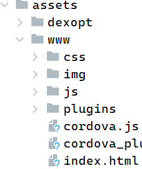
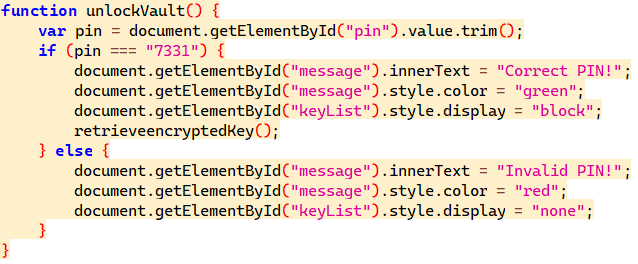

## Scenario

> People say you should store your keys offline in cold storage, so I built this offline app! I think that's what cold storage means 🤔

By CryptoCat

## Solution

We can decompile the `.apk` file using JADX, after I read the java code there was nothing interesting but when I looked at the assets of the application I found an html file.



After reading the html file I found that after entering the pin `7331` it will call the `retrieveencryptedKey` function.



Which will call the `keygen` class to generate an encrypted key that will be displayed on the user's screen.


There is a `keygen.js` file in the `js` folder which contains the following:

```js
(function(_0x506dbf,_0x170411){const _0x12e004=a0_0x1707,_0x3fbe25=_0x506dbf();while(!![]){try{const _0x3b5636=parseInt(_0x12e004(0x122))/0x1*(parseInt(_0x12e004(0x117))/0x2)+-parseInt(_0x12e004(0x111))/0x3*(-parseInt(_0x12e004(0x121))/0x4)+-parseInt(_0x12e004(0x11b))/0x5*(parseInt(_0x12e004(0x11f))/0x6)+parseInt(_0x12e004(0x113))/0x7*(-parseInt(_0x12e004(0x11d))/0x8)+parseInt(_0x12e004(0x125))/0x9*(parseInt(_0x12e004(0x11e))/0xa)+-parseInt(_0x12e004(0x123))/0xb+parseInt(_0x12e004(0x120))/0xc*(parseInt(_0x12e004(0x112))/0xd);if(_0x3b5636===_0x170411)break;else _0x3fbe25['push'](_0x3fbe25['shift']());}catch(_0x18c02d){_0x3fbe25['push'](_0x3fbe25['shift']());}}}(a0_0x32dd,0x4ff3a));function a0_0x32dd(){const _0xb65be8=['9425749445e494332757363353f5d6f50353b79445d7336343270373270366f586365753f546c60336f5','length','map','38495LKnOYO','substr','8lZAZpw','6486450oYKfNK','402RerQLO','12MNesgS','4FulGyI','528939ZPevpd','861608xHrljL','split','9gQnkOh','toString','242571ENkSLa','502515FcoXSF','2628171KytvIJ','push','slice','join','2HiwuOL'];a0_0x32dd=function(){return _0xb65be8;};return a0_0x32dd();}function affineEncrypt(_0x1930bc,_0x36e79b,_0x33477e){return(_0x36e79b*_0x1930bc+_0x33477e)%0x100;}function xor(_0x3a38fa,_0x3c3309){return _0x3a38fa^_0x3c3309;}function a0_0x1707(_0x3d4d4c,_0x35b685){const _0x32dd9d=a0_0x32dd();return a0_0x1707=function(_0x170770,_0x4c15fe){_0x170770=_0x170770-0x110;let _0x3e6dad=_0x32dd9d[_0x170770];return _0x3e6dad;},a0_0x1707(_0x3d4d4c,_0x35b685);}function hexToBytes(_0x1d9eb0){const _0x3e7222=a0_0x1707;let _0x2ac99a=[];for(let _0x2363dc=0x0;_0x2363dc<_0x1d9eb0[_0x3e7222(0x119)];_0x2363dc+=0x2){_0x2ac99a[_0x3e7222(0x114)](parseInt(_0x1d9eb0[_0x3e7222(0x11c)](_0x2363dc,0x2),0x10));}return _0x2ac99a;}function reverseString(_0x22dcba){const _0x102ddd=a0_0x1707;return _0x22dcba[_0x102ddd(0x124)]('')['reverse']()[_0x102ddd(0x116)]('');}function keygen(){const _0x588caa=a0_0x1707;let _0x620410=_0x588caa(0x118),_0x19eb60=[_0x620410[_0x588caa(0x115)](0x0,0xe),_0x620410[_0x588caa(0x115)](0xe,0x1c),_0x620410[_0x588caa(0x115)](0x1c,0x2a),_0x620410[_0x588caa(0x115)](0x2a,0x38),_0x620410['slice'](0x38,0x46),_0x620410[_0x588caa(0x115)](0x46,0x54)],_0x4c2f5e=[_0x19eb60[0x3],_0x19eb60[0x5],_0x19eb60[0x1],_0x19eb60[0x4],_0x19eb60[0x2],_0x19eb60[0x0]],_0x22e526=reverseString(_0x4c2f5e['join']('')),_0x2051e9=hexToBytes(_0x22e526),_0x3788f1=0x9,_0x2afabe=0x7,_0x56285d=0x33,_0x351569=_0x2051e9['map'](_0x585a6f=>xor(affineEncrypt(_0x585a6f,_0x3788f1,_0x2afabe),_0x56285d));return _0x351569[_0x588caa(0x11a)](_0x5ca89b=>('0'+_0x5ca89b[_0x588caa(0x110)](0x10))[_0x588caa(0x115)](-0x2))[_0x588caa(0x116)]('');}
```

After some identitation the code looks like this:

```js
(function (_0x506dbf, _0x170411) { 
    const _0x12e004 = a0_0x1707, _0x3fbe25 = _0x506dbf(); 
    while (!![]) { 
        try { 
            const _0x3b5636 = parseInt(_0x12e004(0x122)) / 0x1 * (parseInt(_0x12e004(0x117)) / 0x2) + -parseInt(_0x12e004(0x111)) / 0x3 * (-parseInt(_0x12e004(0x121)) / 0x4) + -parseInt(_0x12e004(0x11b)) / 0x5 * (parseInt(_0x12e004(0x11f)) / 0x6) + parseInt(_0x12e004(0x113)) / 0x7 * (-parseInt(_0x12e004(0x11d)) / 0x8) + parseInt(_0x12e004(0x125)) / 0x9 * (parseInt(_0x12e004(0x11e)) / 0xa) + -parseInt(_0x12e004(0x123)) / 0xb + parseInt(_0x12e004(0x120)) / 0xc * (parseInt(_0x12e004(0x112)) / 0xd); 
            if (_0x3b5636 === _0x170411) break; 
            else _0x3fbe25['push'](_0x3fbe25['shift']()); 
        } catch (_0x18c02d) { 
            _0x3fbe25['push'](_0x3fbe25['shift']()); 
        } 
    } 
}(a0_0x32dd, 0x4ff3a)); 

function a0_0x32dd() { 
    const _0xb65be8 = ['9425749445e494332757363353f5d6f50353b79445d7336343270373270366f586365753f546c60336f5', 'length', 'map', '38495LKnOYO', 'substr', '8lZAZpw', '6486450oYKfNK', '402RerQLO', '12MNesgS', '4FulGyI', '528939ZPevpd', '861608xHrljL', 'split', '9gQnkOh', 'toString', '242571ENkSLa', '502515FcoXSF', '2628171KytvIJ', 'push', 'slice', 'join', '2HiwuOL']; 
    a0_0x32dd = function () { return _0xb65be8; };
    return a0_0x32dd(); 
} 

function affineEncrypt(_0x1930bc, _0x36e79b, _0x33477e) { 
    return (_0x36e79b * _0x1930bc + _0x33477e) % 0x100; 
} 

function xor(_0x3a38fa, _0x3c3309) { 
    return _0x3a38fa ^ _0x3c3309; 
} 

function a0_0x1707(_0x3d4d4c, _0x35b685) { 
    const _0x32dd9d = a0_0x32dd(); 
    return a0_0x1707 = function (_0x170770, _0x4c15fe) { 
        _0x170770 = _0x170770 - 0x110; let _0x3e6dad = _0x32dd9d[_0x170770]; 
        return _0x3e6dad; 
    }, a0_0x1707(_0x3d4d4c, _0x35b685); 
} 

function hexToBytes(_0x1d9eb0) { 
    const _0x3e7222 = a0_0x1707; 
    let _0x2ac99a = []; 
    for (let _0x2363dc = 0x0; _0x2363dc < _0x1d9eb0[_0x3e7222(0x119)]; _0x2363dc += 0x2) { 
        _0x2ac99a[_0x3e7222(0x114)](parseInt(_0x1d9eb0[_0x3e7222(0x11c)](_0x2363dc, 0x2), 0x10)); 
    } 
    
    return _0x2ac99a; 
} 

function reverseString(_0x22dcba) { 
    const _0x102ddd = a0_0x1707; 
    return _0x22dcba[_0x102ddd(0x124)]('')['reverse']()[_0x102ddd(0x116)](''); 
} 

function keygen() { 
    const _0x588caa = a0_0x1707; 
    let _0x620410 = _0x588caa(0x118), 
    _0x19eb60 = [
        _0x620410[_0x588caa(0x115)](0x0, 0xe), 
        _0x620410[_0x588caa(0x115)](0xe, 0x1c), 
        _0x620410[_0x588caa(0x115)](0x1c, 0x2a), 
        _0x620410[_0x588caa(0x115)](0x2a, 0x38),
        _0x620410['slice'](0x38, 0x46), 
        _0x620410[_0x588caa(0x115)](0x46, 0x54)
    ], _0x4c2f5e = [_0x19eb60[0x3], _0x19eb60[0x5], _0x19eb60[0x1], _0x19eb60[0x4], _0x19eb60[0x2], _0x19eb60[0x0]], _0x22e526 = reverseString(_0x4c2f5e['join']('')), _0x2051e9 = hexToBytes(_0x22e526), _0x3788f1 = 0x9, _0x2afabe = 0x7, _0x56285d = 0x33, _0x351569 = _0x2051e9['map'](_0x585a6f => xor(affineEncrypt(_0x585a6f, _0x3788f1, _0x2afabe), _0x56285d)); 
    return _0x351569[_0x588caa(0x11a)](_0x5ca89b => ('0' + _0x5ca89b[_0x588caa(0x110)](0x10))[_0x588caa(0x115)](-0x2))[_0x588caa(0x116)](''); 
}
```

After reading the code we can see that the `keygen` function will generate the encrypted key. The `keygen` function will split the key into 6 parts and then reverse the order of the parts and then convert the hex string to bytes and then encrypt the bytes using the affine encryption algorithm and then xor the result with `0x33`.

```js
let _0x620410 = "9425749445e494332757363353f5d6f50353b79445d7336343270373270366f586365753f546c60336f5";
let _0x19eb60 = [
    _0x620410.slice(0, 14),
    _0x620410.slice(14, 28),
    _0x620410.slice(28, 42),
    _0x620410.slice(42, 56),
    _0x620410.slice(56, 70),
    _0x620410.slice(70)
];

let _0x4c2f5e = [_0x19eb60[3], _0x19eb60[5], _0x19eb60[1], _0x19eb60[4], _0x19eb60[2], _0x19eb60[0]]
let _0x22e526 = reverseString(_0x4c2f5e.join(''));
let _0x2051e9 = hexToBytes(_0x22e526);
let _0x3788f1 = 9;
let _0x2afabe = 7;
let _0x56285d = 51;
let _0x351569 = _0x2051e9.map(_0x585a6f => xor(affineEncrypt(_0x585a6f, _0x3788f1, _0x2afabe), _0x56285d));
return _0x351569.map(_0x5ca89b => ('0' + _0x5ca89b.toString(16)).slice(-2)).join('');
```

We can run the javascript code in the browser console to get the encrypted key. And then we can decrypt the key using the following python code:

```py
def mod_inverse(a):
    for i in range(256):
        if (a * i) % 256 == 1:
            return i

def affine_decrypt(a, b, x):
    return mod_inverse(a) * (x - b) % 256

encrypted_bytes = bytes.fromhex("abf6c8abb5daabc8ab69d7846def17b19c6dae843a6dd7e1b1173ae16db184e0b86dd7c5843ae8dee15f")

xor_value = 51
multiplier = 9
increment = 7

decrypted_bytes = [affine_decrypt(multiplier, increment, byte ^ xor_value) for byte in encrypted_bytes]
print(f'Flag: {bytes(decrypted_bytes).decode()}')
```

Or... you can just do

```js
function reverseString(_0x22dcba) { 
    return _0x22dcba.split('').reverse().join('');
} 

let _0x620410 = "9425749445e494332757363353f5d6f50353b79445d7336343270373270366f586365753f546c60336f5";
let _0x19eb60 = [
    _0x620410.slice(0, 14),
    _0x620410.slice(14, 28),
    _0x620410.slice(28, 42),
    _0x620410.slice(42, 56),
    _0x620410.slice(56, 70),
    _0x620410.slice(70)
];

let _0x4c2f5e = [_0x19eb60[3], _0x19eb60[5], _0x19eb60[1], _0x19eb60[4], _0x19eb60[2], _0x19eb60[0]]
let _0x22e526 = reverseString(_0x4c2f5e.join(''));

console.log(`Flag: ${_0x22e526.match(/.{1,2}/g).map(byte => String.fromCharCode(parseInt(byte, 16))).join('')}`);
```