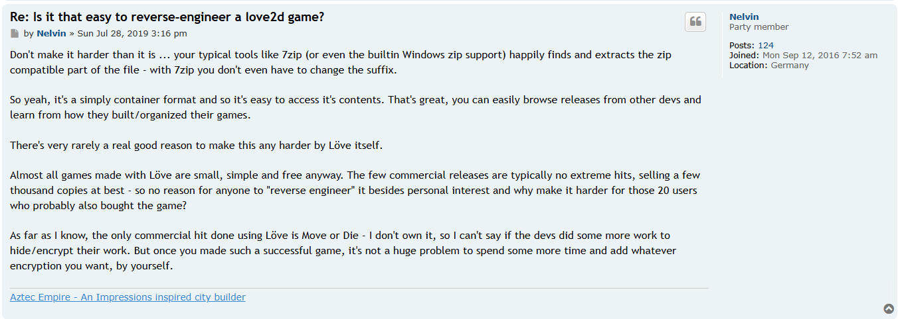

> bur bur bur bur burhanpedia

---

A `game.zip` file is provided, containing the game's executable and shared libraries like `love.dll` and `lua51.dll`. So, it's clear that this is a game made with [LÖVE](https://love2d.org/) (a 2D game engine that uses Lua as its programming language).

Searching for keywords like "love2d reverse engineering," I found a user in [this](https://love2d.org/forums/viewtopic.php?p=228552&sid=bc69f9607cd4941d246f156a4a745ac2#p228552) post stating that you can extract the `.exe` file to get Lua files, assets, and the like.



After extracting, we can see several Lua files and three folders. However, these Lua files have been compiled into `luajit bytecode`, so we need to decompile them to see their contents. We can use [luadec](https://luadec.metaworm.site/) to decompile these Lua files.

So, from all the decompilation results, I concluded that there are three important files: `enc.lua`, `cell.lua`, `elems.lua`, and `main.lua`.

In the `enc.lua` file, we can find the `drawWin()` function.

```lua
function r0_0.drawWin()
  -- line: [73, 92] id: 1
  local r0_1 = love.graphics.newFont(20)
  love.graphics.push()
  love.graphics.setColor(1, 1, 1)
  love.graphics.setFont(r0_1)
  local r2_1 = r0_0.decrypt(_G.WIN_MSG, r0_0.hash(_G.CLICKED))
  love.graphics.print(r2_1, (_G.X - r0_1:getWidth(r2_1)) / 2, (_G.Y - r0_1.getHeight(r0_1)) / 2)
  love.graphics.pop()
end
```

We can see here that there is a `decrypt` function where we need two globals, namely `_G.WIN_MSG` and `_G.CLICKED`. Where `_G.WIN_MSG` is in `main.lua` and `CLICKED` is the number of clicks we made in the game when we clicked safely. So when is `drawWin()` called?

```lua
if CELLS_CLICKED == _G.TOTAL_SAFE then
  love.graphics.setColor(0, 0, 0)
  love.graphics.rectangle("fill", 0, 0, _G.X, _G.Y)
  r5_0.drawWin()
end
```

So our `CELLS_CLICKED` should be the same as `_G.TOTAL_SAFE` which is 70 so how does this `CELLS_CLICKED` increase?

```lua
local r4_1 = r3_0.mousePressedMines(mf, r0_1, r1_1, r2_1)
if r4_1.revealed then
  CELLS_CLICKED = CELLS_CLICKED + 1
  if not r4_1.safe then
    hitMine = true
  end
end
```

It turns out this increases if we click on a safe cell. Now, how do we know if the cell we clicked on is safe or not? Since `r3_0` is an `elems`, the function is in `elems.lua`.

```lua
function r0_0.mousePressedMines(r0_3, r1_3, r2_3, r3_3)
  -- line: [214, 263] id: 3
  local r4_3 = r14_0(r0_3)
  local r5_3 = r4_3.cellSize + r4_0
  local r6_3 = r4_3.mfW * r4_3.cellSize + (r4_3.mfW - 1) * r4_0
  local r7_3 = r4_3.mfH * r4_3.cellSize + (r4_3.mfH - 1) * r4_0
  if r1_3 < r4_3.gridStartX or r4_3.gridStartX + r6_3 < r1_3 or r2_3 < r4_3.gridStartY or r4_3.gridStartY + r7_3 < r2_3 then
    return {
      revealed = false,
      safe = false,
    }
  end
  local r8_3 = r12_0(math.floor((r1_3 - r4_3.gridStartX) / r5_3) + 1, 1, r4_3.mfW)
  local r9_3 = r12_0(math.floor((r2_3 - r4_3.gridStartY) / r5_3) + 1, 1, r4_3.mfH)
  local r11_3 = r2_3 - r4_3.gridStartY
  if r4_3.cellSize < (r1_3 - r4_3.gridStartX) % r5_3 or r4_3.cellSize < r11_3 % r5_3 then
    return {
      revealed = false,
      safe = false,
    }
  end
  local r12_3 = _G.CURRENT_DEPTH
  local r13_3 = r0_0.revealedCells
  local r14_3 = r0_0.revealedCells[r12_3]
  if not r14_3 then
    r14_3 = {}
  end
  r13_3[r12_3] = r14_3
  r13_3 = r0_0.revealedCells[r12_3]
  r14_3 = r0_0.revealedCells[r12_3][r8_3]
  if not r14_3 then
    r14_3 = {}
  end
  r13_3[r8_3] = r14_3
  if r0_0.revealedCells[r12_3][r8_3][r9_3] then
    return {
      revealed = false,
      safe = true,
    }
  end
  r13_3 = r0_3.cells[r8_3][r9_3][r12_3]
  r14_3 = r13_3.isSafe(r13_3)
  if r14_3 then
    r0_0.revealedCells[r12_3][r8_3][r9_3] = true
    table.insert(_G.CLICKED, {
      r8_3,
      r9_3,
      r12_3
    })
  end
  local r15_3 = r10_0
  local r16_3 = r10_0[r12_3]
  if not r16_3 then
    r16_3 = {}
  end
  r15_3[r12_3] = r16_3
  r15_3 = r10_0[r12_3]
  r16_3 = r10_0[r12_3][r8_3]
  if not r16_3 then
    r16_3 = {}
  end
  r15_3[r8_3] = r16_3
  r10_0[r12_3][r8_3][r9_3] = 0
  return {
    revealed = true,
    safe = r14_3,
  }
end
```

`r14_3` is the result of `cell.isSafe()` for that `(x=r8_3, y=r9_3, z=_G.CURRENT_DEPTH)`. If true, it marks the cell "revealed" and appends `(x,y,z)` to `_G.CLICKED`. This is the exact dataset that becomes the decryption key after sorting and hashing.

```lua
function r0_0.isSafe(r0_1)
  -- line: [19, 43] id: 1
  local r1_1 = r0_1.x
  local r2_1 = r0_1.y
  local r3_1 = r0_1.z
  local r4_1 = {
    nil,
    "8b086383a7198331",
    "a9b692550cc0f7f5",
    "b0b909d976004ec4",
    "f41ffbeee187e196",
    "0003ecb317464021",
    "da1c8435445c1911",
    "e3f3a11350ab2f1b",
    "f487cb0cb274985a",
    "7d0794365098fe9b",
    "21d0154651618672",
    "7bed6f85c47b5716",
    "e77eaab06692db91",
    "0b825cdf48054cc5",
    "cac6139603012b76",
    "b36d4292e3836717",
    "58dca52604a10cc9",
    "7e68cf5b3cdcc63f",
    "7c3d54174a37a7c8",
    "11ff4ee926bb37a4",
    "63f3884422021122",
    "bdcf12b90b7d0585",
    "c07e91b14b246089",
    "6676cd16954a5945",
    "f8fed551bbdbdae2",
    "2071ad22dc0ef1aa",
    "6e0558ff006e6378",
    "be9db55232fcf23e",
    "512b7a400687951f",
    "511287b0b00bd48e",
    "c502948028e6736b",
    "95aa3a491a7a1a9e",
    "80cbba6d0a78c66b",
    "1c71982e6b2a839a",
    "211ae8862a8ec6bb",
    "441db02d818902f6",
    "7ff6c3cb41cafcc5",
    "c7622c661fc9f404",
    "6e70a7a6bf24a3b5",
    "bce1853e7a22bd06",
    "ede08eada8b70a05",
    "7d67b0f64122229a",
    "559a4dbaadc63863",
    "73246b69b6e93b94",
    "e3c6b96aeaaba63c",
    "2e090c2bb8d03f37",
    "d5352762560eaa93",
    "6b9976ead6f538e2",
    "800bc774ee4c9abf",
    "a70a4385c5a9c1e3",
    "504890a525a269d9",
    "d97b0912efea7883",
    "5c8d659c018ce8d3",
    "cb0c44182288783e",
    "c3586bf717ed2fe4",
    "6e7ab1cfe90c21ab",
    "d340351393467df9",
    "1e98b7a1afebf662",
    "412d5cb3888d2082",
    "092e05e1153b6850",
    "5cac7c8162641e79",
    "125c9d51ff1e830a",
    "ae4248b0f8139d85",
    "c66101259d277b28",
    "3fe648d2182bca2d",
    "533b82521038b593",
    "1433ddbbc56ad287",
    "5a5ba449571cdcc8",
    "43eb35843b3c1f91",
    "551c08983a6facb5",
    "374b1d850b95f31d",
    "41f5c23b59068096",
    "61cfbfc9b58de6dd",
    "cc48256872e3c462",
    "01af79cdf3e0d079",
    "0f3c45b943c479d3",
    "b50d3448ae08d415",
    "2eefc0af8c255fe3",
    "9154f851ccf3dc64",
    "d4ca9764e3ca8f1a",
    "5531acbbf4339359",
    "e01b954446baaf66",
    "0d7326003ea4b196",
    "437c0d433253a063",
    "3172b1f74b323b0a",
    "a35afd3b4fc07d56",
    "f7f744485cc22c6e",
    "66aec8cec26ce8a4",
    "2e3e99781985eea6",
    "de67c8f76a2a0318",
    "5669dd69ca6d8ac9",
    "8c3e75d93a1c5884",
    "88ecddfbd7e7b2f6",
    "6fa3b5d67933e963",
    "bdd59cb997bd2da8",
    "31b67c90de20a328",
    "07852c77314259eb",
    "3c45f78069d7f536",
    "d5478ae4df8cbdcf",
    "b0559e1df23ae9af",
    "75dcb521bba96a54",
    "ff051eca1645f00b",
    "6742cc171d27d5fa",
    "1cc3e0d97f701923",
    "2a36abb111f62781",
    "f1161e776d9988b6",
    "9b1b15b23e58a3ff",
    "6bd1d309ca116058",
    "16ce4a9cd249d2c9",
    "1e4302b4498aef99",
    "f072705954d2fab9",
    "888312c0427de158",
    "f0e36f0bbc4e92fc",
    "8c657b5ee3dd162e",
    "e8d8eaa4d6f4e693",
    "3dbd89832e6c1a68",
    "6b31d305732b6c0d",
    "3df99d491ac9e013",
    "7a58cd27b6fe12c3",
    "813a39881a8f5cf9",
    "c711884fdfc0ede7",
    "6095360d1f44d2c4",
    "8718a37070c0baca",
    "66f2570458f3ef43",
    "99ba3187b785db16",
    "e095980f403ca13c",
    "c242139c514f9b9a",
    "1880851fe45d5bf7",
    "17d0c7136fd2e728",
    "2aa5208b81ccf27e",
    "349f858b24297ae0",
    "86e24a7be8e05f2b",
    "ffb8b26d9426f0fe",
    "385e5d6c3b995ec8",
    "881696da95d4eefe",
    "924eeb095f2cab5d",
    "2ba083ad0f2af719",
    "9998b1b1bef2e036",
    "4c38f5a9f57e2ea1",
    "f19bda0031e06dc5",
    "28e9887b63b92e14",
    "e40c916464337574",
    "2aff0927afe95b33",
    "00af48823c64845b",
    "1a3d8728c51d1a0c",
    "bf5fcb864a4d0643",
    "1f549d7951b5c58f",
    "2eb8cf5e874cd786",
    "785a05518ec31a52",
    "d9e11221916934a3",
    "717d9447e7251e05",
    "52cab44ace44c736",
    "b2d028beff9dc6d4",
    "f5de72c6cbe25978",
    "1a85efdad71213eb",
    "ecf8aa3e3410e20f",
    "f1f86b2a07070247",
    "f1ad94f99e45d605",
    "9f6c57bd9ad8e1a0",
    "b83f8bf56143da9f",
    "48fe5b4b6f1ee78a",
    "676120c8a2f7a3cc",
    "684be2678743b5d4",
    "34c62f3506412681",
    "8b85a19d3f39c038",
    "95c925666ee3ef58",
    "da9aca4fb9388a24",
    "7f651fea83e8f7dc",
    "4b3faf0765ada606",
    "6a5ba72e6ae23d5f",
    "185297c1a1390dbd"
  }
  local r5_1 = {
    nil,
    "3919ea621056d864",
    "02c681d7cc3e4a4b",
    "f4cbc21d523a7a8e",
    "71fdbf511fc9416f",
    "f4d00c9cf6d72b27",
    "bf8b94160c0f912f",
    "e5030755ec81cbe0",
    "0325d6c1080c79e1",
    "e4f2c3ab5b54ae53",
    "393a1a94b0e3a733",
    "5a0b8382a457705f",
    "9e3b6232cb7bd60e",
    "7382c3c1ae4d06c6",
    "a710bf2254470971",
    "bc326c0db05535f6",
    "36a516d225315abf",
    "28aa7ac9f621f25a",
    "ac3ee0977802ad9e",
    "1b5dae259b45744c",
    "027cbcf7bc30db15",
    "7e02bbb5a0080e68",
    "5ce5695fc14e6302",
    "0503393543d166cb",
    "767b5a3e8de74030",
    "bb0346db30223523",
    "9511fd971a097d21",
    "c4eceac7365bd580",
    "7d96506f20ae2206",
    "7e94da5740443ec8",
    "33c995ef4bb3f05a",
    "3764691a1b638fd5",
    "17d18472fc4d59e9",
    "2fe269ee87e93bf6",
    "949c716196f7d1ee",
    "1663c1c95236db16",
    "b0c9e7a9e1f907bf",
    "cc15ae341213c374",
    "eaefda8f2aedd6d0",
    "5260cea8cceb03fd",
    "14bf92e800e28664",
    "77b95f280695a686",
    "03b1101c22e41e08",
    "0fa56d7c020cc7b7",
    "75c8c98216e17608",
    "10227fa31647ccfd",
    "84ef557b626c0d70",
    "884d34eece35617d",
    "815106adc7256d3f",
    "5ca16e365a26913e",
    "3e470efba934845a",
    "1e7fdd3affa21e01",
    "c36562c53838cb8e",
    "10aab89f099100ba",
    "050221c4bce41e51",
    "a49f835079f0d470",
    "a24cc8ec4a0372f4",
    "1219bf7ef233f045",
    "89999daa9d362b62",
    "f183f7424acde76b",
    "864a936a35324151",
    "95a383a442c051ab",
    "9458350d6e174b2c",
    "fb8f7c51fd0144b9",
    "85eeadccc1794b55",
    "09ca6900764c6f43",
    "58c73a965e924d59",
    "744fb3f7a4e56015",
    "fd71d6c2cea354a7",
    "98c1d47c393b8a87",
    "a532a7380c18ccfb",
    "defea5cebe1a8054",
    "bbe814c133ff5912",
    "c55d1110f4ca2099",
    "572e10fe14a83e36",
    "c9b1cb30ca668f20",
    "3cf5c245480fd471",
    "e43f460454555b2a",
    "4a46e7abb931e762",
    "96eee7fdfe9d5362",
    "d37fbb06388ef92a",
    "519278624a8832d5",
    "d6c2fba0fe4dc21d",
    "8359d08d9b60ccfd",
    "10788a26641c4187",
    "1cb16d7ccd265877",
    "16adc2f18817fbf8",
    "7af7aa4e9120a33b",
    "157ab10e223cfa86",
    "014e9fb03ec3e152",
    "3e03c0cd7f382bfa",
    "9a0251ab1bca1c47",
    "3773b01776ce0156",
    "93661967c5350c19",
    "ffca1716a06b8c84",
    "7195242ffc970357",
    "54469967e163370b",
    "9c8902aec0f62d83",
    "60e7548f2980518b",
    "06cddd50035d89b1",
    "7cf6977351f5e913",
    "7fdc10869c66195e",
    "44d39c6e5e7b45bf",
    "56ae331cef94dc85",
    "ebcbd43c67c580c8",
    "2cfa73d1bf1c3028",
    "4c30fcc85a514069",
    "72586738b687dd11",
    "558b0b585c427f28",
    "9d3013df6b413a07",
    "7d28809654c99976",
    "3a50377f8f5efd15",
    "8950101d9f3e8417",
    "3c328a440b398326",
    "3703843e80f39188",
    "aa615f5000881af1",
    "b23d7cbfdc71ee1b",
    "0f5135115926fb85",
    "f9a43657b0c3abe9",
    "e162b61d3d7146e5",
    "323775c4f9b6ce6a",
    "00092cab56c063b7",
    "cd6f3117349be031",
    "7c367013d0f47641",
    "fc595889b32c31df",
    "40c4fad484744b31",
    "ac699b3c4bd5d6e2",
    "5620abf0ed6570b5",
    "1a4de96cd3a2fa4d",
    "f302016db2fbc8db",
    "a1b22f60cfdd66cb",
    "5083b6c278d4d12e",
    "5119b118f91db186",
    "3456d1f927098019",
    "27991ee8d8a3187e",
    "b37415448f52de64",
    "0b42d71285c2346b",
    "d66d3f2c187ac599",
    "b117636b9bae2bce",
    "dde0438d507326ad",
    "ed6eaaf2becfb33f",
    "aa6e3c31416abdb1",
    "1368807b39cf381a",
    "545aaf0a3bc6b7c9",
    "949192369aff2a2a",
    "133806ca086fa756",
    "cb06ae8f4f7338b3",
    "f4e3e60f85b2e5ac",
    "4eea0d0ff3fdf721",
    "a88d93eb9353450a",
    "19d853112b38ca27",
    "7f8d950933e78ca1",
    "e6ed7f393091d090",
    "d1e1c441b1bb21a0",
    "bf3b2d402ccd6fbc",
    "aa2170e35b0fef42",
    "d0dda5e6a709b521",
    "4940f484332ce1ec",
    "ca902d4a8acbdea1",
    "ddb8d361ee700085",
    "a72ee2ce95a69a57",
    "e4a64360f61e588c",
    "34fa9bb3c6be0fdf",
    "600cb180b5f3ecfc",
    "89de0fd153857c6f",
    "b45dcf719696d9f7",
    "73cd9f27540deebf",
    "8cc98cec8aab5c68",
    "891b18b759447efa",
    "0e1d52a5c3f576d6",
    "4e3f79891e92947d"
  }
  local r6_1 = {
    nil,
    "72dbc1d0c9905717",
    "52bb7cc738dbf5e5",
    "7f80e6caa06901e1",
    "2c903ae837b047fd",
    "3b7dc65fd47fd991",
    "48b361d46638bfa4",
    "a7bb4472588958f3",
    "5c3d91e81ae54157",
    "0252b081bda70b47",
    "481d60bc802f5158",
    "53e38ea20dcd0179",
    "e0c7bfa5b8e4ae0c",
    "2cde073b39dd6bb1",
    "6ad4a6b1e5ea5569",
    "585579aed1c5241b",
    "3d734d729009b74c",
    "a829c72c42755e38",
    "e66f404f78b6875b",
    "59933d776452c8a5",
    "a5a2b61e6d380d20",
    "6a175db84aeefddb",
    "62f73707683b924b",
    "f2adeac9190ca809",
    "0927a0c81213ef0e",
    "28fdc24c9abb066e",
    "a2de21b4327dde0e",
    "c5207b559b018772",
    "87557ad1d2f9c362",
    "ae6ce4a7288056e4",
    "c403741c4121989a",
    "262b06d105e1c865",
    "b22eb34537f6f675",
    "2f5b70c621fdcb0d",
    "8c9a013ab70c0434",
    "0aab5e232c5075e4",
    "f6c9da6121853fcc",
    "27bb55ca7d1e8404",
    "26773930fcd8dfa9",
    "ad8fa913d25b3970",
    "9d551151d7152670",
    "332d88d62030ed15",
    "f87f6a02d81b2a46",
    "1090b9e9eba719a3",
    "52a6932d5af5316a",
    "770c3cbf77615a1d",
    "d15eff82084cddbc",
    "cdad86ca9450d1c1",
    "61f1658abb279309",
    "c13ed90781221133",
    "6686fc4c74906865",
    "35ea9e03d5f2f465",
    "18bed1232c7d6375",
    "0baee19b37f19906",
    "2021dc8bd93e4492",
    "f37f3f2b0dc57a86",
    "ce8457d59078a699",
    "9ecd60ff3bca4fec",
    "162fda1c3929b763",
    "6a6408e6702b2586",
    "ffab53082b58bed6",
    "1c63ed9164d61acf",
    "120e52d7b556d767",
    "bba1dc9846ddd9a4",
    "ed053874ca199cc5",
    "2c3f699f4b5f7734",
    "46957db596ec41cc",
    "17402467b764a015",
    "078468f27b81b84b",
    "1b365a4dfc8a9d9d",
    "d58144b2c72e6dbb",
    "a77b6cbdf6fae167",
    "09a1b036b82baba3",
    "5904c93073387f89",
    "01ce4b291ad3ecd2",
    "0ebe0fb634f8e4ac",
    "3bbcf69de876e98a",
    "34847964b077f2b9",
    "4fdc8d7d404bc073",
    "a025f0314b164d72",
    "aaf5060b9517ba4f",
    "236b565af6b51282",
    "8b49203c3d36d3f6",
    "46d4c7c3285e2d04",
    "6557739a67283a8d",
    "c1fcf0cd023db10f",
    "1ad269a743bd01b5",
    "eedaf2856c6f433b",
    "46c1776477b5d009",
    "165940940a02a187",
    "03b0bd366e8184f8",
    "fa3cfb3f1bb823aa",
    "18cb37e2865113e6",
    "58eb0dd988df36c5",
    "f2a0f718b02f355a",
    "92c5fd0421c1d619",
    "86cb35a822329fe1",
    "2f1d593cd98cb5bf",
    "85a915d17097bdeb",
    "bb4d3bd125603e48",
    "072ba5cc0e81ff74",
    "fb8a0d2da8683cec",
    "e7d5f7be5195d606",
    "a0d9819c45694767",
    "2e0b3dc70916553a",
    "ee14860f6bd0506d",
    "3837e1aa083f578c",
    "b906e4061c4a678d",
    "f5334f59cc820a5c",
    "35edaef5199e008d",
    "5c2e13bb6c475cb7",
    "580ade0f132b4228",
    "a0d177b4967a6d99",
    "f7961248034a58c4",
    "8352dd9eb8b64669",
    "a1271642c26ded1a",
    "b0f40e2bace115cb",
    "3fd388b5f0aea188",
    "7a64ce427ce0ca96",
    "b96cb18015f6896c",
    "19b8db7132366437",
    "40dd2b010d461c24",
    "51e8ea280b44e169",
    "caa1aedb2a6ce96b",
    "5cd53812071ab9bb",
    "9532f197bbc85d99",
    "b366c0efba99d592",
    "434dbd07bc54f593",
    "cb68dbec7d3df253",
    "0f9c6877b9e900ca",
    "da4d43f295ce9263",
    "2b1545d9e4c56859",
    "9cfd3c755be26b4e",
    "14a79e51478113c6",
    "369b906a75d37219",
    "70260742c2952154",
    "de2d0a787b335176",
    "ccbcd0d62f439eac",
    "8ba5ef4e282bf7bc",
    "673a620c399f2825",
    "228971770cc3111e",
    "d40fbd13d527595c",
    "2782526eaa0c5c25",
    "858a794b9a1df6e2",
    "15811bd57b46d002",
    "43e8852bef636588",
    "3ef4ba73834a4409",
    "68bf6c87ebcd6379",
    "314e9ad1bb068ed1",
    "2f1987bf98c09d2f",
    "9f484139a27415ae",
    "d4b9aead1dd10a59",
    "4be84111a613654b",
    "f72b71f2cf7221d1",
    "283f3aceea5cb2cb",
    "d8f548dedc438e25",
    "f8b7291025863577",
    "93a2b2c622983580",
    "2aec3694418f35d8",
    "74e9f3d8efbda803",
    "a080bd4f0f513eec",
    "c24703aeed68217a",
    "bb34d581b8484ccf",
    "e64474fd91f16a08",
    "9ec5adcb162fea7b",
    "e4890f15c8a2d18e",
    "23c657f2efda7731",
    "9e6296be2bb963df",
    "a93706e865c271f4",
    "337b02741a9561b6",
    "770e6f5e2f55c90a"
  }
  local function r7_1(r0_2)
    -- line: [28, 30] id: 2
    return string.sub(love.data.encode("string", "hex", love.data.hash("sha256", tostring(r0_2 % 4294967296))), 1, 16)
  end
  local r8_1 = r7_1(r1_0.bxor(r1_1 * 73856093, r1_0.bxor(r2_1 * 19349663, r3_1 * 83492791)))
  local r9_1 = r7_1(r1_0.bxor(r1_0.bor(r1_0.lshift(r1_1, 11), r1_0.bor(r1_0.lshift(r2_1, 5), r1_0.lshift(r3_1, 3))), r1_1 * r2_1 * r3_1))
  local r10_1 = r7_1((r1_0.bxor(r1_1, r1_0.lshift(r3_1, 7)) + r1_0.bxor(r2_1, r1_0.lshift(r1_1, 3)) - r1_0.bxor(r3_1, r1_0.lshift(r2_1, 1))) % 4294967296)
  local r11_1 = false
  local r12_1 = false
  local r13_1 = false
  for r17_1, r18_1 in ipairs(r4_1) do
    if r18_1 == r8_1 then
      r11_1 = true
      break
    end
  end
  for r17_1, r18_1 in ipairs(r5_1) do
    if r18_1 == r9_1 then
      r12_1 = true
      break
    end
  end
  for r17_1, r18_1 in ipairs(r6_1) do
    if r18_1 == r10_1 then
      r13_1 = true
      break
    end
  end
  local r14_1 = r11_1
  if r14_1 then
    r14_1 = r12_1
    if r14_1 then
      r14_1 = r13_1
    end
  end
  return r14_1
end
```

Safety is **purely deterministic** based on `(x,y,z)` via three 32-bit–reduced integers run through SHA-256 (hex), truncated to 16 hex chars. If all three truncations appear in `TABLE1`, `TABLE2`, and `TABLE3` respectively, the cell is safe. There's no randomness: the safe set is fixed for the whole 3D grid.

```py
import hashlib
import base64

TABLE1 = {
    '8b086383a7198331',
    'a9b692550cc0f7f5',
    'b0b909d976004ec4',
    'f41ffbeee187e196',
    '0003ecb317464021',
    'da1c8435445c1911',
    'e3f3a11350ab2f1b',
    'f487cb0cb274985a',
    '7d0794365098fe9b',
    '21d0154651618672',
    '7bed6f85c47b5716',
    'e77eaab06692db91',
    '0b825cdf48054cc5',
    'cac6139603012b76',
    'b36d4292e3836717',
    '58dca52604a10cc9',
    '7e68cf5b3cdcc63f',
    '7c3d54174a37a7c8',
    '11ff4ee926bb37a4',
    '63f3884422021122',
    'bdcf12b90b7d0585',
    'c07e91b14b246089',
    '6676cd16954a5945',
    'f8fed551bbdbdae2',
    '2071ad22dc0ef1aa',
    '6e0558ff006e6378',
    'be9db55232fcf23e',
    '512b7a400687951f',
    '511287b0b00bd48e',
    'c502948028e6736b',
    '95aa3a491a7a1a9e',
    '80cbba6d0a78c66b',
    '1c71982e6b2a839a',
    '211ae8862a8ec6bb',
    '441db02d818902f6',
    '7ff6c3cb41cafcc5',
    'c7622c661fc9f404',
    '6e70a7a6bf24a3b5',
    'bce1853e7a22bd06',
    'ede08eada8b70a05',
    '7d67b0f64122229a',
    '559a4dbaadc63863',
    '73246b69b6e93b94',
    'e3c6b96aeaaba63c',
    '2e090c2bb8d03f37',
    'd5352762560eaa93',
    '6b9976ead6f538e2',
    '800bc774ee4c9abf',
    'a70a4385c5a9c1e3',
    '504890a525a269d9',
    'd97b0912efea7883',
    '5c8d659c018ce8d3',
    'cb0c44182288783e',
    'c3586bf717ed2fe4',
    '6e7ab1cfe90c21ab',
    'd340351393467df9',
    '1e98b7a1afebf662',
    '412d5cb3888d2082',
    '092e05e1153b6850',
    '5cac7c8162641e79',
    '125c9d51ff1e830a',
    'ae4248b0f8139d85',
    'c66101259d277b28',
    '3fe648d2182bca2d',
    '533b82521038b593',
    '1433ddbbc56ad287',
    '5a5ba449571cdcc8',
    '43eb35843b3c1f91',
    '551c08983a6facb5',
    '374b1d850b95f31d',
    '41f5c23b59068096',
    '61cfbfc9b58de6dd',
    'cc48256872e3c462',
    '01af79cdf3e0d079',
    '0f3c45b943c479d3',
    'b50d3448ae08d415',
    '2eefc0af8c255fe3',
    '9154f851ccf3dc64',
    'd4ca9764e3ca8f1a',
    '5531acbbf4339359',
    'e01b954446baaf66',
    '0d7326003ea4b196',
    '437c0d433253a063',
    '3172b1f74b323b0a',
    'a35afd3b4fc07d56',
    'f7f744485cc22c6e',
    '66aec8cec26ce8a4',
    '2e3e99781985eea6',
    'de67c8f76a2a0318',
    '5669dd69ca6d8ac9',
    '8c3e75d93a1c5884',
    '88ecddfbd7e7b2f6',
    '6fa3b5d67933e963',
    'bdd59cb997bd2da8',
    '31b67c90de20a328',
    '07852c77314259eb',
    '3c45f78069d7f536',
    'd5478ae4df8cbdcf',
    'b0559e1df23ae9af',
    '75dcb521bba96a54',
    'ff051eca1645f00b',
    '6742cc171d27d5fa',
    '1cc3e0d97f701923',
    '2a36abb111f62781',
    'f1161e776d9988b6',
    '9b1b15b23e58a3ff',
    '6bd1d309ca116058',
    '16ce4a9cd249d2c9',
    '1e4302b4498aef99',
    'f072705954d2fab9',
    '888312c0427de158',
    'f0e36f0bbc4e92fc',
    '8c657b5ee3dd162e',
    'e8d8eaa4d6f4e693',
    '3dbd89832e6c1a68',
    '6b31d305732b6c0d',
    '3df99d491ac9e013',
    '7a58cd27b6fe12c3',
    '813a39881a8f5cf9',
    'c711884fdfc0ede7',
    '6095360d1f44d2c4',
    '8718a37070c0baca',
    '66f2570458f3ef43',
    '99ba3187b785db16',
    'e095980f403ca13c',
    'c242139c514f9b9a',
    '1880851fe45d5bf7',
    '17d0c7136fd2e728',
    '2aa5208b81ccf27e',
    '349f858b24297ae0',
    '86e24a7be8e05f2b',
    'ffb8b26d9426f0fe',
    '385e5d6c3b995ec8',
    '881696da95d4eefe',
    '924eeb095f2cab5d',
    '2ba083ad0f2af719',
    '9998b1b1bef2e036',
    '4c38f5a9f57e2ea1',
    'f19bda0031e06dc5',
    '28e9887b63b92e14',
    'e40c916464337574',
    '2aff0927afe95b33',
    '00af48823c64845b',
    '1a3d8728c51d1a0c',
    'bf5fcb864a4d0643',
    '1f549d7951b5c58f',
    '2eb8cf5e874cd786',
    '785a05518ec31a52',
    'd9e11221916934a3',
    '717d9447e7251e05',
    '52cab44ace44c736',
    'b2d028beff9dc6d4',
    'f5de72c6cbe25978',
    '1a85efdad71213eb',
    'ecf8aa3e3410e20f',
    'f1f86b2a07070247',
    'f1ad94f99e45d605',
    '9f6c57bd9ad8e1a0',
    'b83f8bf56143da9f',
    '48fe5b4b6f1ee78a',
    '676120c8a2f7a3cc',
    '684be2678743b5d4',
    '34c62f3506412681',
    '8b85a19d3f39c038',
    '95c925666ee3ef58',
    'da9aca4fb9388a24',
    '7f651fea83e8f7dc',
    '4b3faf0765ada606',
    '6a5ba72e6ae23d5f',
    '185297c1a1390dbd',
}

TABLE2 = {
    '3919ea621056d864',
    '02c681d7cc3e4a4b',
    'f4cbc21d523a7a8e',
    '71fdbf511fc9416f',
    'f4d00c9cf6d72b27',
    'bf8b94160c0f912f',
    'e5030755ec81cbe0',
    '0325d6c1080c79e1',
    'e4f2c3ab5b54ae53',
    '393a1a94b0e3a733',
    '5a0b8382a457705f',
    '9e3b6232cb7bd60e',
    '7382c3c1ae4d06c6',
    'a710bf2254470971',
    'bc326c0db05535f6',
    '36a516d225315abf',
    '28aa7ac9f621f25a',
    'ac3ee0977802ad9e',
    '1b5dae259b45744c',
    '027cbcf7bc30db15',
    '7e02bbb5a0080e68',
    '5ce5695fc14e6302',
    '0503393543d166cb',
    '767b5a3e8de74030',
    'bb0346db30223523',
    '9511fd971a097d21',
    'c4eceac7365bd580',
    '7d96506f20ae2206',
    '7e94da5740443ec8',
    '33c995ef4bb3f05a',
    '3764691a1b638fd5',
    '17d18472fc4d59e9',
    '2fe269ee87e93bf6',
    '949c716196f7d1ee',
    '1663c1c95236db16',
    'b0c9e7a9e1f907bf',
    'cc15ae341213c374',
    'eaefda8f2aedd6d0',
    '5260cea8cceb03fd',
    '14bf92e800e28664',
    '77b95f280695a686',
    '03b1101c22e41e08',
    '0fa56d7c020cc7b7',
    '75c8c98216e17608',
    '10227fa31647ccfd',
    '84ef557b626c0d70',
    '884d34eece35617d',
    '815106adc7256d3f',
    '5ca16e365a26913e',
    '3e470efba934845a',
    '1e7fdd3affa21e01',
    'c36562c53838cb8e',
    '10aab89f099100ba',
    '050221c4bce41e51',
    'a49f835079f0d470',
    'a24cc8ec4a0372f4',
    '1219bf7ef233f045',
    '89999daa9d362b62',
    'f183f7424acde76b',
    '864a936a35324151',
    '95a383a442c051ab',
    '9458350d6e174b2c',
    'fb8f7c51fd0144b9',
    '85eeadccc1794b55',
    '09ca6900764c6f43',
    '58c73a965e924d59',
    '744fb3f7a4e56015',
    'fd71d6c2cea354a7',
    '98c1d47c393b8a87',
    'a532a7380c18ccfb',
    'defea5cebe1a8054',
    'bbe814c133ff5912',
    'c55d1110f4ca2099',
    '572e10fe14a83e36',
    'c9b1cb30ca668f20',
    '3cf5c245480fd471',
    'e43f460454555b2a',
    '4a46e7abb931e762',
    '96eee7fdfe9d5362',
    'd37fbb06388ef92a',
    '519278624a8832d5',
    'd6c2fba0fe4dc21d',
    '8359d08d9b60ccfd',
    '10788a26641c4187',
    '1cb16d7ccd265877',
    '16adc2f18817fbf8',
    '7af7aa4e9120a33b',
    '157ab10e223cfa86',
    '014e9fb03ec3e152',
    '3e03c0cd7f382bfa',
    '9a0251ab1bca1c47',
    '3773b01776ce0156',
    '93661967c5350c19',
    'ffca1716a06b8c84',
    '7195242ffc970357',
    '54469967e163370b',
    '9c8902aec0f62d83',
    '60e7548f2980518b',
    '06cddd50035d89b1',
    '7cf6977351f5e913',
    '7fdc10869c66195e',
    '44d39c6e5e7b45bf',
    '56ae331cef94dc85',
    'ebcbd43c67c580c8',
    '2cfa73d1bf1c3028',
    '4c30fcc85a514069',
    '72586738b687dd11',
    '558b0b585c427f28',
    '9d3013df6b413a07',
    '7d28809654c99976',
    '3a50377f8f5efd15',
    '8950101d9f3e8417',
    '3c328a440b398326',
    '3703843e80f39188',
    'aa615f5000881af1',
    'b23d7cbfdc71ee1b',
    '0f5135115926fb85',
    'f9a43657b0c3abe9',
    'e162b61d3d7146e5',
    '323775c4f9b6ce6a',
    '00092cab56c063b7',
    'cd6f3117349be031',
    '7c367013d0f47641',
    'fc595889b32c31df',
    '40c4fad484744b31',
    'ac699b3c4bd5d6e2',
    '5620abf0ed6570b5',
    '1a4de96cd3a2fa4d',
    'f302016db2fbc8db',
    'a1b22f60cfdd66cb',
    '5083b6c278d4d12e',
    '5119b118f91db186',
    '3456d1f927098019',
    '27991ee8d8a3187e',
    'b37415448f52de64',
    '0b42d71285c2346b',
    'd66d3f2c187ac599',
    'b117636b9bae2bce',
    'dde0438d507326ad',
    'ed6eaaf2becfb33f',
    'aa6e3c31416abdb1',
    '1368807b39cf381a',
    '545aaf0a3bc6b7c9',
    '949192369aff2a2a',
    '133806ca086fa756',
    'cb06ae8f4f7338b3',
    'f4e3e60f85b2e5ac',
    '4eea0d0ff3fdf721',
    'a88d93eb9353450a',
    '19d853112b38ca27',
    '7f8d950933e78ca1',
    'e6ed7f393091d090',
    'd1e1c441b1bb21a0',
    'bf3b2d402ccd6fbc',
    'aa2170e35b0fef42',
    'd0dda5e6a709b521',
    '4940f484332ce1ec',
    'ca902d4a8acbdea1',
    'ddb8d361ee700085',
    'a72ee2ce95a69a57',
    'e4a64360f61e588c',
    '34fa9bb3c6be0fdf',
    '600cb180b5f3ecfc',
    '89de0fd153857c6f',
    'b45dcf719696d9f7',
    '73cd9f27540deebf',
    '8cc98cec8aab5c68',
    '891b18b759447efa',
    '0e1d52a5c3f576d6',
    '4e3f79891e92947d',
}

TABLE3 = {
    '72dbc1d0c9905717',
    '52bb7cc738dbf5e5',
    '7f80e6caa06901e1',
    '2c903ae837b047fd',
    '3b7dc65fd47fd991',
    '48b361d46638bfa4',
    'a7bb4472588958f3',
    '5c3d91e81ae54157',
    '0252b081bda70b47',
    '481d60bc802f5158',
    '53e38ea20dcd0179',
    'e0c7bfa5b8e4ae0c',
    '2cde073b39dd6bb1',
    '6ad4a6b1e5ea5569',
    '585579aed1c5241b',
    '3d734d729009b74c',
    'a829c72c42755e38',
    'e66f404f78b6875b',
    '59933d776452c8a5',
    'a5a2b61e6d380d20',
    '6a175db84aeefddb',
    '62f73707683b924b',
    'f2adeac9190ca809',
    '0927a0c81213ef0e',
    '28fdc24c9abb066e',
    'a2de21b4327dde0e',
    'c5207b559b018772',
    '87557ad1d2f9c362',
    'ae6ce4a7288056e4',
    'c403741c4121989a',
    '262b06d105e1c865',
    'b22eb34537f6f675',
    '2f5b70c621fdcb0d',
    '8c9a013ab70c0434',
    '0aab5e232c5075e4',
    'f6c9da6121853fcc',
    '27bb55ca7d1e8404',
    '26773930fcd8dfa9',
    'ad8fa913d25b3970',
    '9d551151d7152670',
    '332d88d62030ed15',
    'f87f6a02d81b2a46',
    '1090b9e9eba719a3',
    '52a6932d5af5316a',
    '770c3cbf77615a1d',
    'd15eff82084cddbc',
    'cdad86ca9450d1c1',
    '61f1658abb279309',
    'c13ed90781221133',
    '6686fc4c74906865',
    '35ea9e03d5f2f465',
    '18bed1232c7d6375',
    '0baee19b37f19906',
    '2021dc8bd93e4492',
    'f37f3f2b0dc57a86',
    'ce8457d59078a699',
    '9ecd60ff3bca4fec',
    '162fda1c3929b763',
    '6a6408e6702b2586',
    'ffab53082b58bed6',
    '1c63ed9164d61acf',
    '120e52d7b556d767',
    'bba1dc9846ddd9a4',
    'ed053874ca199cc5',
    '2c3f699f4b5f7734',
    '46957db596ec41cc',
    '17402467b764a015',
    '078468f27b81b84b',
    '1b365a4dfc8a9d9d',
    'd58144b2c72e6dbb',
    'a77b6cbdf6fae167',
    '09a1b036b82baba3',
    '5904c93073387f89',
    '01ce4b291ad3ecd2',
    '0ebe0fb634f8e4ac',
    '3bbcf69de876e98a',
    '34847964b077f2b9',
    '4fdc8d7d404bc073',
    'a025f0314b164d72',
    'aaf5060b9517ba4f',
    '236b565af6b51282',
    '8b49203c3d36d3f6',
    '46d4c7c3285e2d04',
    '6557739a67283a8d',
    'c1fcf0cd023db10f',
    '1ad269a743bd01b5',
    'eedaf2856c6f433b',
    '46c1776477b5d009',
    '165940940a02a187',
    '03b0bd366e8184f8',
    'fa3cfb3f1bb823aa',
    '18cb37e2865113e6',
    '58eb0dd988df36c5',
    'f2a0f718b02f355a',
    '92c5fd0421c1d619',
    '86cb35a822329fe1',
    '2f1d593cd98cb5bf',
    '85a915d17097bdeb',
    'bb4d3bd125603e48',
    '072ba5cc0e81ff74',
    'fb8a0d2da8683cec',
    'e7d5f7be5195d606',
    'a0d9819c45694767',
    '2e0b3dc70916553a',
    'ee14860f6bd0506d',
    '3837e1aa083f578c',
    'b906e4061c4a678d',
    'f5334f59cc820a5c',
    '35edaef5199e008d',
    '5c2e13bb6c475cb7',
    '580ade0f132b4228',
    'a0d177b4967a6d99',
    'f7961248034a58c4',
    '8352dd9eb8b64669',
    'a1271642c26ded1a',
    'b0f40e2bace115cb',
    '3fd388b5f0aea188',
    '7a64ce427ce0ca96',
    'b96cb18015f6896c',
    '19b8db7132366437',
    '40dd2b010d461c24',
    '51e8ea280b44e169',
    'caa1aedb2a6ce96b',
    '5cd53812071ab9bb',
    '9532f197bbc85d99',
    'b366c0efba99d592',
    '434dbd07bc54f593',
    'cb68dbec7d3df253',
    '0f9c6877b9e900ca',
    'da4d43f295ce9263',
    '2b1545d9e4c56859',
    '9cfd3c755be26b4e',
    '14a79e51478113c6',
    '369b906a75d37219',
    '70260742c2952154',
    'de2d0a787b335176',
    'ccbcd0d62f439eac',
    '8ba5ef4e282bf7bc',
    '673a620c399f2825',
    '228971770cc3111e',
    'd40fbd13d527595c',
    '2782526eaa0c5c25',
    '858a794b9a1df6e2',
    '15811bd57b46d002',
    '43e8852bef636588',
    '3ef4ba73834a4409',
    '68bf6c87ebcd6379',
    '314e9ad1bb068ed1',
    '2f1987bf98c09d2f',
    '9f484139a27415ae',
    'd4b9aead1dd10a59',
    '4be84111a613654b',
    'f72b71f2cf7221d1',
    '283f3aceea5cb2cb',
    'd8f548dedc438e25',
    'f8b7291025863577',
    '93a2b2c622983580',
    '2aec3694418f35d8',
    '74e9f3d8efbda803',
    'a080bd4f0f513eec',
    'c24703aeed68217a',
    'bb34d581b8484ccf',
    'e64474fd91f16a08',
    '9ec5adcb162fea7b',
    'e4890f15c8a2d18e',
    '23c657f2efda7731',
    '9e6296be2bb963df',
    'a93706e865c271f4',
    '337b02741a9561b6',
    '770e6f5e2f55c90a',
}

def sha256_hex32(val: int) -> str:
    s = str(val % (2**32)).encode()
    h = hashlib.sha256(s).hexdigest()
    return h[:16]

def is_safe(x, y, z):
    h1 = sha256_hex32((x * 73856093) ^ (y * 19349663 ^ z * 83492791))
    h2 = sha256_hex32(((x << 11) | (y << 5) | (z << 3)) ^ (x * y * z))
    h3 = sha256_hex32(((x ^ (z << 7)) + (y ^ (x << 3)) - (z ^ (y << 1))) % (2**32))
    return h1 in TABLE1 and h2 in TABLE2 and h3 in TABLE3

def build_clicked(width, height, depth):
    clicked = []
    for z in range(1, depth + 1):
        for x in range(1, width + 1):
            for y in range(1, height + 1):
                if is_safe(x, y, z):
                    clicked.append((x, y, z))

    clicked.sort(key=lambda t: (t[0], t[1], t[2]))
    return clicked

def clicked_hash(clicked):
    joined = ';'.join(f'{x},{y},{z}' for x, y, z in clicked)
    digest = hashlib.sha384(joined.encode()).digest()
    return base64.b64encode(digest).decode()

def lua_xor(data: bytes, key: bytes) -> bytes:
    out = bytearray()
    n = len(data)
    for i in range(n):
        out.append(data[i] ^ key[i % len(key)])

    return bytes(out)

def decrypt_win(cipher_b64, key_b64):
    data = base64.b64decode(cipher_b64)
    key = base64.b64decode(key_b64)
    return lua_xor(data, key).decode(errors='ignore')

for i in range(32 + 1):
    # Example usage (fill dimensions from mfW, mfH, SIZE):
    mfW, mfH, SIZE = 32, 32, i  # ← guess, confirm with your code
    CLICKED = build_clicked(mfW, mfH, SIZE)
    print('Safe cells:', len(CLICKED))  # should be 170
    key_b64 = clicked_hash(CLICKED)

    WIN_MSG = '6ktTOQqLL6ltQzBqNFy0qsIixCMlCLeh3f1tQ2L+oPGSZAHv/f+UxeGEngJC0Fvb3XYuNnmvTM9tFXg6Wgb9'
    decrypted = decrypt_win(WIN_MSG, key_b64)
    if 'COMPFEST' in decrypted:
        print(f'({i}) Decrypted: {decrypted}')
```
