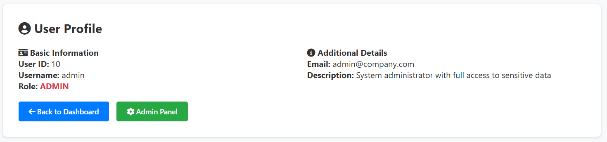
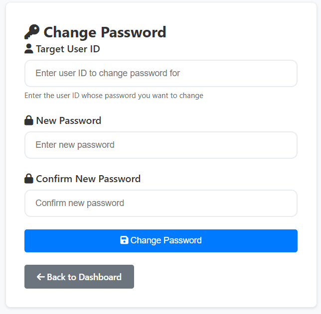
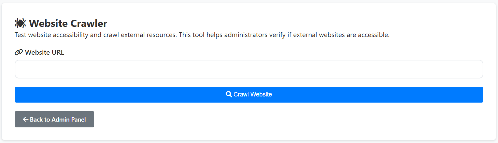
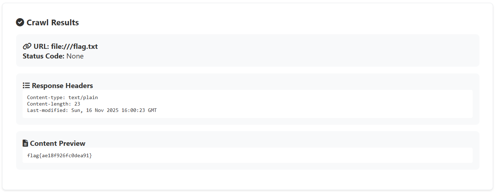

> Just a normal warmup challenge here is the guest creds guest:guest123 the flag is in /flag.txt

---

Given a simple web challenge with the credentials `guest:guest123`. The User Management System (Dashboard) contains two menus: Profile and Change Password.

In the Profile menu, we can view information about the currently logged in user. The endpoint is `/profile/<id>`, where `<id>` is the user ID. From here, we can attempt to access another user's profile (IDOR) by changing the ID in the URL. Using ID bruteforce, we can find a user with ID 10 (random each instance?) with the username `admin`.

In the Change Password menu, we can change the password of the user.

Interestingly, there's an input form for the user ID, allowing us to change another user's password (IDOR) by entering the "admin" user ID we found earlier.

There's a website crawler on the admin dashboard that can access other websites from the server.

Here we can exploit this feature to access the `/flag.txt` file on the server by entering the URL `file:///flag.txt` in the crawler input form.

