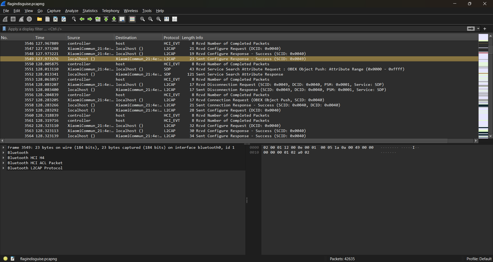
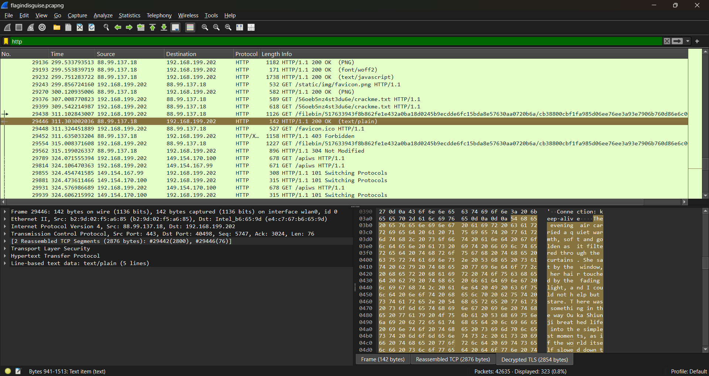
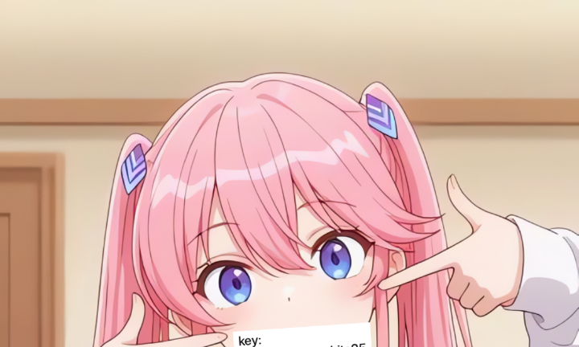
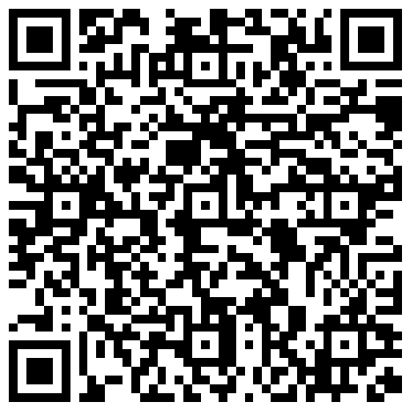

> We hadn’t spoken in ages since he got involved in things he never explained. Last night, at the cafe where we used to share ideas, he handed me files that looked ordinary at first, yet something about them felt hidden. He’s never one to do anything without a reason.

---

So in this challenge, we're given a PCAPNG file named `flagindisguise.pcapng`. We can use the `capinfos` command to get basic information about the PCAPNG file:

```
File name:           flagindisguise.pcapng
File type:           Wireshark/... - pcapng
File encapsulation:  Per packet
Encapsulation in use by packets (# of pkts):
                     Ethernet (38212)
                     Bluetooth H4 with linux header (4423)
File timestamp precision:  per-packet (-1)
Packet size limit:   file hdr: (not set)
Number of packets:   42 k
File size:           39 MB
Data size:           37 MB
Capture duration:    536.119621576 seconds
Earliest packet time: 2025-10-14 17:03:16.825445638
Latest packet time:   2025-10-14 17:12:12.945067214
Data byte rate:      69 kBps
Data bit rate:       555 kbps
Average packet size: 873.47 bytes
Average packet rate: 79 packets/s
SHA256:              474908685c2a89f06cf9f5cf8d0c50c25059513551adf96bf2925d745b5c48b7
SHA1:                85961a61665fab23e49f7567187ed5cc3e3f9784
Strict time order:   False
Capture hardware:    13th Gen Intel(R) Core(TM) i5-1335U (with SSE4.2)
Capture oper-sys:    Linux 6.12.50-1-lts
Capture application: Dumpcap (Wireshark) 4.4.9
Number of interfaces in file: 2
Interface #0 info:
                     Name = wlan0
                     Encapsulation = Ethernet (1 - ether)
                     Capture length = 262144
                     Time precision = nanoseconds (9)
                     Time ticks per second = 1000000000
                     Time resolution = 0x09
                     Operating system = Linux 6.12.50-1-lts
                     Number of stat entries = 0
                     Number of packets = 38212
Interface #1 info:
                     Name = bluetooth0
                     Encapsulation = Bluetooth H4 with linux header (99 - bluetooth-h4-linux)
                     Capture length = 262144
                     Time precision = microseconds (6)
                     Time ticks per second = 1000000
                     Time resolution = 0x06
                     Operating system = Linux 6.12.50-1-lts
                     Number of stat entries = 0
                     Number of packets = 4423
Number of decryption secrets in file: 1
```

We can see that this PCAPNG file contains Bluetooth and Ethernet packets. After further analysis using Wireshark, we discovered that there are many OBEX (Object Exchange) packets in the capture.



So, in this packet capture, there are two files sent via the OBEX protocol: a PDF file and a ZIP file. We can extract both files by filtering the OBEX packets based on the frame number range containing the file data. Since only the `0x48` (Body) header contains a `value`, we can use `obex.header.value.byte_sequence` to extract the data. We then combine all the extracted data from each packet into a single file.

Here is the `tshark` command used to extract both files:

```sh
$ tshark -r flagindisguise.pcapng -Y "frame.number>=32238 && frame.number<=35950 && obex" -T fields -e obex.header.value.byte_sequence | tr -d '\n' | xxd -r -p > secret.pdf
$ tshark -r flagindisguise.pcapng -Y "frame.number>=3579 && frame.number<=16236 && obex" -T fields -e obex.header.value.byte_sequence | tr -d '\n' | xxd -r -p > cofidential.zip
```

After extracting, we found two files named `secret.pdf` and `cofidential.zip`.

In the `secret.pdf` file, we found that there was a PNG image file embedded inside it containing a QR code.

However, in the `cofidential.zip` file, we found that it was password-protected. After further analysis, we discovered that the `cofidential.zip` file was encrypted using Legacy ZIP encryption. Legacy ZIP encryption has a security flaw that allows us to use a known-plaintext attack to obtain the keystream used to encrypt the file. With this keystream, we can decrypt other encrypted files.

Now, how do we get the known-plaintext? Upon further inspection, it turns out that the `cofidential.zip` file contains files named `crackme.txt` and `key.png`. We can use the magic header bytes from the PNG image file as known-plaintext (I don't know if it's possible or not, just an assumption) but here I use the contents of the `crackme.txt` file as known-plaintext obtained from the HTTP traffic in the packet capture.



```filename=crackme.txt
The evening air carried a quiet warmth, soft and golden as it filtered through the curtains. She sat by the window, her hair touched by the fading light, and I could not help but stare. There was something in the way Ouka Shiunji breathed life into the simplest moments, as if the world itself slowed down to match her rhythm. The sounds outside were distant, the city fading into a blur, while in this small room, time bent gently around her. She turned her head slightly, catching me watching, and the corners of her lips curved into a smile that made my heart stumble.

I rose from where I sat, trying to move with the kind of calm confidence that completely betrayed how fast my pulse was racing. “You’re staring again,” she said, her voice laced with that playful lilt that always made me smile before I even realized it. “I’m just making sure this is real,” I murmured, reaching out to brush a stray lock of hair from her face. Her laughter was quiet and melodic, the kind that fills the space between two people with something warm and invisible. I could feel the air change, a delicate current of closeness that made the world seem smaller, softer, and impossibly more beautiful.

As the night deepened, shadows stretched across the walls like gentle waves, and the stars began to spill into view one by one. We sat together without speaking, her hand resting in mine, fingers interlaced in a silence that said more than words ever could. The calm around us was not emptiness; it was full, alive, and brimming with meaning. Every breath she took seemed to sync with mine, every heartbeat a quiet confession of how much she meant to me. In that moment, there was no past and no future, only the soft certainty that love could be simple, tender, and endless when it was with her. Ouka Shiunji was not just the light in the room; she was the warmth that stayed long after the stars had faded.
```

Using the `crackme.txt` file as known-plaintext, we can use the `bkcrack` tool to obtain the keystream used to encrypt the `key.png` file.

```pwsh
.\bkcrack.exe -C ../download.zip -c crackme.txt -p ../crackme.txt
.\bkcrack.exe -C ../download.zip -c key.png -k 7a17e571 cec357b5 443a35b4 -d ../crackme.txt
```

However, when opened, the `key.png` file contains a key, but the key is cropped because the image's height has been changed. Therefore, we need to modify the image's height so that the entire key can be seen.




We'll get a key that looks like `ouk4kaw4i1inschits25`. But what's the point of this key? And what's the purpose of the QR code in the `secret.pdf` file?



After being scanned, the QR code contains a hex that is 128 bytes long:

```
3fbe12d0608c4fedde2d9359013f9ed6db7cc8a160fed1acb6b14de7eafcaa1b7780d06af4b2859e5c7755ed35bde08f9cdd3a06568199119554a28461ffb475
```

After asking ChatGPT, it turns out the hex is a ciphertext encrypted using AES-256-CBC with the key we previously obtained, `ouk4kaw4i1inschits25`. Because the key is not 128 bits (16 bytes) but 20 bytes, ChatGPT suggests hashing the key using SHA-256 to obtain a 32 byte (256 bit) key, which is compatible with AES-256.

Here is the link to the ChatGPT I used: https://chatgpt.com/share/68f47b95-f638-8001-811e-49bf8ef9329a

Here is the Python script used to decrypt the ciphertext:

```py
import binascii
from Crypto.Cipher import AES
from Crypto.Hash import SHA256
from Crypto.Util.Padding import unpad

password = 'ouk4kaw4i1inschits25'
ct_hex = '3fbe12d0608c4fedde2d9359013f9ed6db7cc8a160fed1acb6b14de7eafcaa1b7780d06af4b2859e5c7755ed35bde08f9cdd3a06568199119554a28461ffb475'

ct = binascii.unhexlify(ct_hex)
key = SHA256.new(password.encode()).digest()
iv = b'\x00' * 16

cipher = AES.new(key, AES.MODE_CBC, iv)
pt = unpad(cipher.decrypt(ct), AES.block_size)
print(pt.decode('utf-8', errors='replace'))
```
