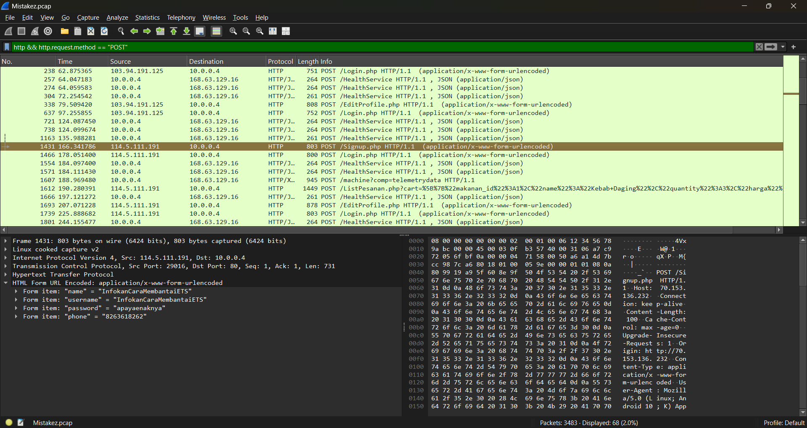

> Keke menjadi admin sebuah web pemesanan makanan. Tetapi tiba - tiba Keke tidak bisa login ke akun admin, setelah diperiksa ternyata password akun admin telah berubah. Hal ini terjadi karena Keke tidak memeriksa kembali aturan dari edit profil.
>
> Tolong bantu Keke menemukan username milik user yang mengganti password dari akun admin
>
> Format flag : SCH25{Username_milik_user_yang_mengganti_password_dari_akun_admin}
>
> contoh : username = baba12345 maka isi flag seperti ini : SCH25{baba12345}

---

Just filter using `http && http.request.method == "POST"`.

