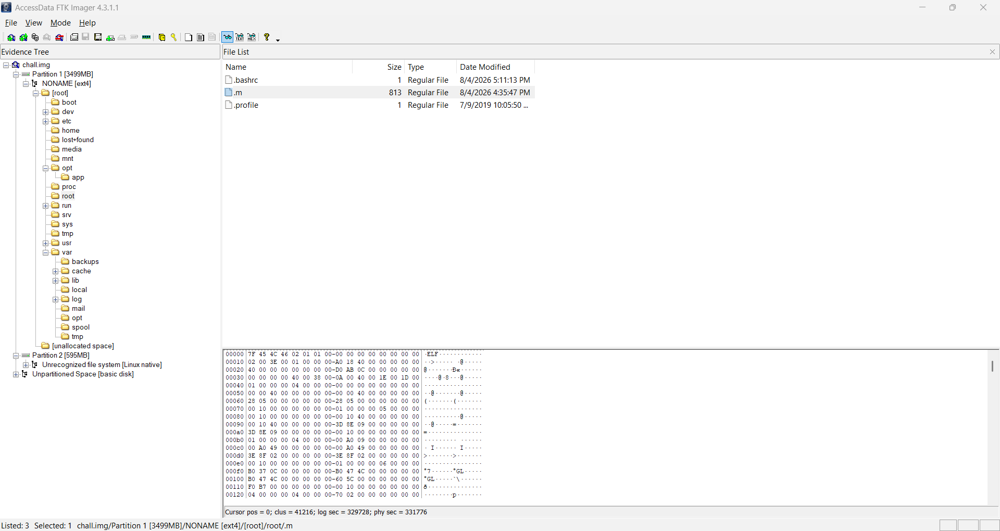
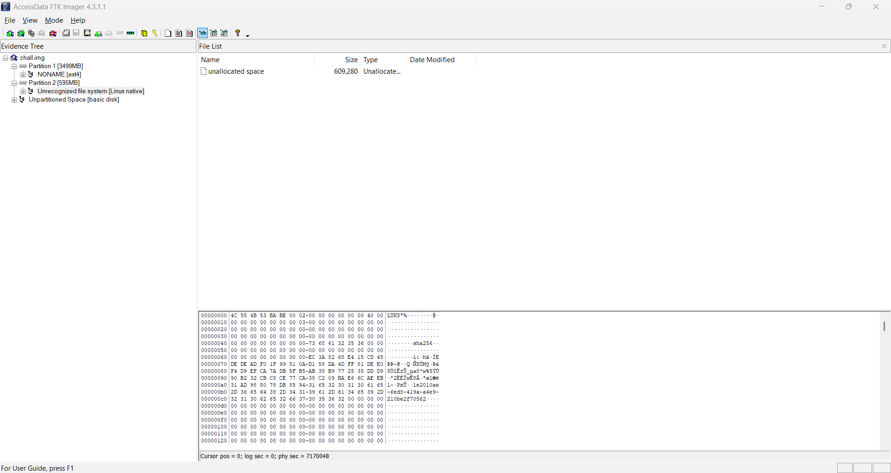
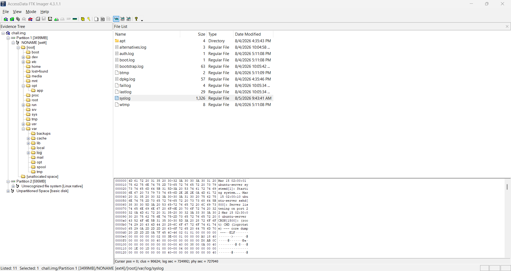
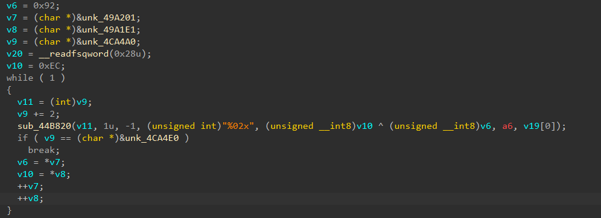

> bang dur otw magang tapi laptopnya kena hack, gimana nyak?
>
> Password: `53599bce04a968bd`
>
> P.S: nggak tanggung jawab kalo ngerjainnya nggak di safe environment
>
> Author: asburg

---

The challenge gives `chall.img` disk image of the compromised machine. Some digging in the first partition surfaces a hidden file with a suspicious name, `/root/.m`:



Uploading the sample to VirusTotal, the behavioral report makes its clear. It LUKS-formats `/dev/sdb2`, opens the resulting volume as `stolen`, and wipes it with `dd`, with the passphrase piped in through stdin:

```
cryptsetup luksFormat /dev/sdb2 -q --key-file=-
cryptsetup open /dev/sdb2 stolen --key-file=-
dd if=/dev/zero of=/dev/mapper/stolen bs=1M
sh -c "dd if=/dev/zero of=/dev/mapper/stolen bs=1M 2>/dev/null"
sh -c "echo -n '7e3b426caac64d470a2224580b55dcda0cb19bd37650be8f9dedfef63bbf2775' | cryptsetup luksFormat /dev/sdb2 -q --key-file=- 2>/dev/null"
sh -c "echo -n '7e3b426caac64d470a2224580b55dcda0cb19bd37650be8f9dedfef63bbf2775' | cryptsetup open /dev/sdb2 stolen --key-file=- 2>/dev/null"
```

Partition 2 of our image carries a `LUKS` header:



`fdisk -l chall.img`:

```
Disk chall.img: 4 GiB, 4294967296 bytes, 8388608 sectors
Units: sectors of 1 * 512 = 512 bytes
Sector size (logical/physical): 512 bytes / 512 bytes
I/O size (minimum/optimal): 512 bytes / 512 bytes
Disklabel type: dos
Disk identifier: 0x62f7955b

Device     Boot   Start     End Sectors  Size Id Type
chall.img1 *       2048 7167999 7165952  3.4G 83 Linux
chall.img2      7170048 8388607 1218560  595M 83 Linux
```

So the stolen data lives in partition 2. Extract it with `dd`:

```bash
dd if=chall.img of=chall.img2 bs=512 \
  skip=7170048 \
  count=1218560 \
  status=progress
```

First try the passphrase the behavioral report captured:

```bash
echo -n '7e3b426caac64d470a2224580b55dcda0cb19bd37650be8f9dedfef63bbf2775' | cryptsetup open chall.img2 stolen --key-file=- 2>/dev/null
```

```
No key available with this passphrase.
```

The passphrase the sandbox saw is not the passphrase that locked the volume. After some research, the syslog inside the image turns up a second ELF, an executable embedded in a core dump:



This one still holds whatever the crashed process kept in RAM. Carving it out is straightforward: find the marker line, then read the ELF header's section table offsets to learn the true size. The carve only needs three fields of the ELF64 header (<https://0xax.gitbooks.io/linux-insides/content/Theory/linux-theory-2.html>):

The should file ends at `e_shoff + e_shnum * e_shentsize`:

```py
import re
import struct

f = open('syslog', 'rb')
data = f.read()
f.close()

match = re.search(b'--- core dump ---\n(?=\x7fELF)', data)
off = match.end()

e_shoff = struct.unpack('<Q', data[off + 40:off + 48])[0]
e_shnum = struct.unpack('<H', data[off + 60:off + 62])[0]
e_shentsize = struct.unpack('<H', data[off + 58:off + 60])[0]

size = e_shoff + e_shnum * e_shentsize
elf = data[off:off + size]

f = open('core-dump', 'wb')
f.write(elf)
f.close()
```

Open in IDA:



The malware XOR-obfuscates its passphrase, and the obfuscation key is a 32-byte value, together with the obfuscated blob itself. XORing the blob with the key recovers the real one:

```py
from pwn import xor

a = bytes.fromhex('EC3B426CAAC64D470A2224580B55DCDA0CB19BD37650BE8F9DEDFEF63BBF2775')
b = bytes.fromhex('92EAEDC67AB6C00DE71D7A89C2CC58B465D121FB5CB62C9ED41F961945991426')

print(xor(a, b).hex())
```

This prints `7ed1afaad0708d4aed3f5ed1c999846e6960ba282ae6921149f268ef7e263353`, and this passphrase opens the volume:

```bash
echo -n '7ed1afaad0708d4aed3f5ed1c999846e6960ba282ae6921149f268ef7e263353' | sudo cryptsetup open chall.img2 stolen --key-file=-
```

```bash
sudo mkdir -p /mnt/stolen
sudo mount -o ro,noload /dev/mapper/stolen /mnt/stole
```

Inside the unlocked filesystem, `/mnt/stolen/durja/Documents/Kerja/catatan_magang.txt` is Durja's internship diary:

```txt
Catatan Harian Magang - PT Nusantara Teknologi
===============================================

Minggu ke-1 (2-6 Juni 2025):
Hari pertama magang dimulai dengan sesi orientasi bersama tim IT. 
Saya diperkenalkan dengan infrastruktur jaringan perusahaan yang 
menggunakan Cisco router dan switch. Mentor saya, Pak Andi, 
memberikan gambaran tentang topologi jaringan yang terdiri dari 
3 VLAN utama: production, development, dan guest network.

Minggu ke-2 (9-13 Juni 2025):
Fokus pada monitoring jaringan menggunakan Wireshark dan Nagios. 
Saya belajar menganalisis traffic pattern dan mendeteksi anomali. 
Ditemukan beberapa percobaan akses tidak sah dari IP eksternal 
yang kemudian diblokir oleh firewall.

Minggu ke-3 (16-20 Juni 2025):
Mulai membantu konfigurasi firewall rules untuk segmentasi 
jaringan. Pak Andi mengajarkan cara menggunakan iptables dan 
nftables. Saya juga mengikuti meeting mingguan dimana dibahas 
tentang incident response plan perusahaan.

Minggu ke-4 (23-27 Juni 2025):
Minggu terakhir ditutup dengan simulasi incident response. 
Saya bertugas sebagai first responder yang mendeteksi dan 
melaporkan insiden. Overall pengalaman magang sangat berharga.

oh iya my prestasi gweh: ITFest2026{sec_eng_bravo_4th_place_lmitd_top_1_region_cbc_rev_role_olivia_big_congratulations_top_solver}
```

<https://chatgpt.com/share/6a76d46f-2bc4-83ec-b11b-035cc0df7391>
