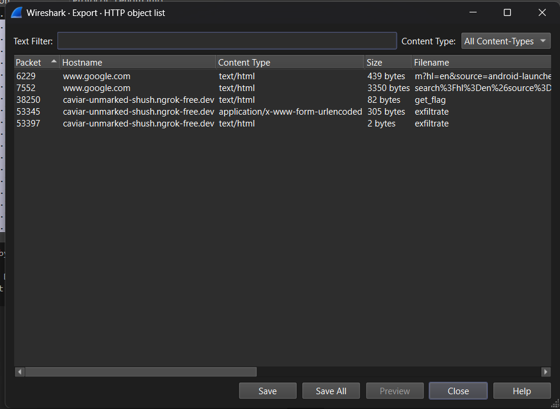

> Bang durrr ingin menjadi petani modern, jadi dia ingin membuat hydroponic dirumahnya. Ia belajar sistem hydroponic menggunakan handphonenya. Tetapi ada apa dengan handphone bang durrr ini?
>
> Password: `LzShMlOxqKWlpvOmLJ5aVUOuoaI0LJ4=`
>
> Author: Fbrina

---

Soo... just open `capture.pcap` in Wireshark and selecting File -> Export Objects -> HTTP... lists the files the phone exchanged over HTTP:



One of the exported objects is named `get_flag`, and its body is a hex string:

```
56475372666732367b4c726c6c6c6c5f6630796933715f6a34786768616c345f7a33613461347a217d
```

From Hex turns it into `VGSrfg26{Lrllll_f0yi3q_j4xghal4_z3a4a4z!}`. A ROT13 brute force confirms it, at key 13:

<https://gchq.github.io/CyberChef/#recipe=From_Hex('None')ROT13_Brute_Force(true,true,false,100,0,true,'')&input=NTY0NzUzNzI2NjY3MzIzNjdiNGM3MjZjNmM2YzZjNWY2NjMwNzk2OTMzNzE1ZjZhMzQ3ODY3Njg2MTZjMzQ1ZjdhMzM2MTM0NjEzNDdhMjE3ZA>