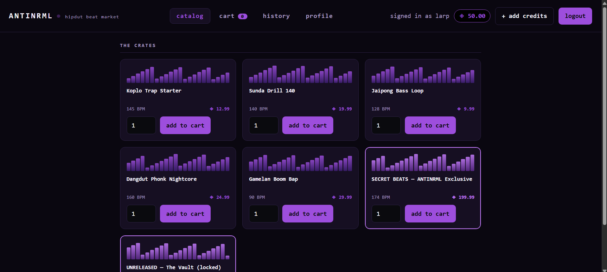
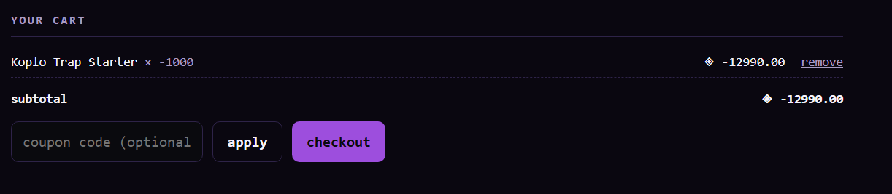
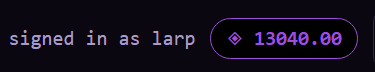
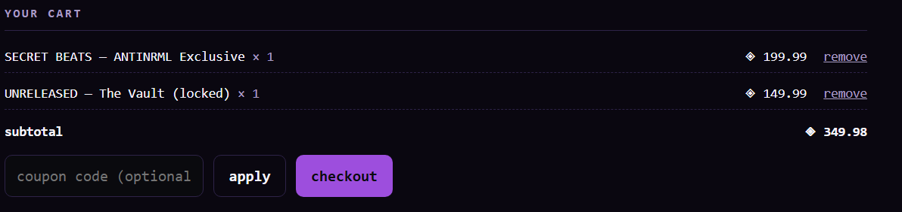
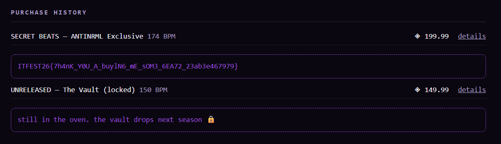

> ANTINRML adalah pasar beat hipdut bawah tanah — tempat producer ketemu pembeli. Sekilas tampilannya kayak toko online biasa: ada login, katalog beat, keranjang, riwayat pembelian, dan profil. Kelihatan seperti aplikasi CRUD e-commerce standar.
>
> Kamu bantuin seorang rapper upcoming dari Citayem yang lagi seret duit. Dia pengen banget si SECRET BEATS — ANTINRML Exclusive, tapi harganya jauh di atas saldo yang dia punya.
>
> Di suatu tempat di dalam sistem ini, master dari beat eksklusif itu disimpan. Ambil.
>
> Daftar akun sendiri untuk memulai
>
> Author: UTARA

---

A regular website, we can add items to our cart, purchase items, and view our purchase history.

Tried buying the item with a minus amount, and it worked, and the purchase was successful. However, the item didn't appear in our purchase history.

However, the money in our account would increase, and we could buy other items that cost more than our initial balance.

Tried buying the two most expensive items.

Just look at our purchase history, and we'll get the flag.

