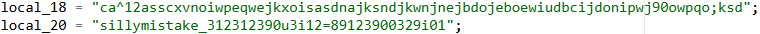
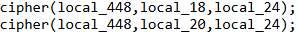
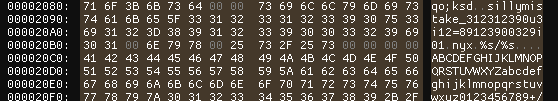

# Tartarus

## Scenario

> My files got encrypted after pirating a game, can you recover it?
>
> Author: **Off5E7**
>
> **WARNING**: Run tartarus with caution.

## Solution

The challenge provides a file named `tartarus` and `flag.txt`. The `tartarus` file is an ELF executable. Running the executable will prompt for a password. The encrypted flag is stored in the `flag.txt.enc` file.

Running the `tartarus` executable will download another ELF executable named `nyx`. The `nyx` executable is a ransomware that encrypts the files in the current directory. The ransomware will encrypt the files using the `XOR` operation with a two key XOR encryption and encode the ciphertext using base64.



The encrypt operation will be performed twice. The first encryption will use the key `ca^12asscxvnoiwpeqwejkxoisasdnajksndjkwnjnejbdojeboewiudbcijdonipwj90owpqo;ksd` and the second encryption will use the key `sillymistake_312312390u3i12=89123900329i01`. The ransomware will then encode the ciphertext using base64.



But... the ransomware has a bug. The ransomware will using first key length to encrypt the file. The first key length is 79 bytes and the second key length is 43 bytes. After second encryption, the ransomware will encrypt the file using the first key length. This will make buffer overflow where after 43 bytes, the ransomware will using garbage value to encrypt the file.

Here how to find the string after 43 bytes:



So the second key is `sillymistake_312312390u3i12=89123900329i01\0nyx\0%s/%s\0\0\0\0ABCDEFGHIJKLMNOPQRSTUV`.

The ransomware will then encode the ciphertext using base64 after each encryption with `cipher` function.

To decrypt the flag, we need to decrypt the `flag.txt` file using the first key and second key. We can use the following python script to decrypt the file:

```py
import base64

def xor_decrypt(data, key, length):
    decrypted_data = bytearray()
    key_len = len(key)
    for i in range(len(data)):
        decrypted_data.append(data[i] ^ key[i % length])
    return decrypted_data

def decode_file(filepath, key1, key2):
    with open(filepath, "rb") as f:
        encrypted_data = f.read()

    base64_decoded_data = base64.b64decode(encrypted_data)
    base64_decoded_data = base64_decoded_data[:-13]

    decrypted_data = xor_decrypt(base64_decoded_data, key2.encode(), len(key1))

    base64_decrypted_data = base64.b64decode(decrypted_data)
    base64_decrypted_data = base64_decrypted_data[:-13]
    
    return xor_decrypt(base64_decrypted_data, key1.encode(), len(key1))

key1 = "ca^12asscxvnoiwpeqwejkxoisasdnajksndjkwnjnejbdojeboewiudbcijdonipwj90owpqo;ksd"
key2 = "sillymistake_312312390u3i12=89123900329i01\0nyx\0%s/%s\0\0\0\0ABCDEFGHIJKLMNOPQRSTUV"

decrypted_content = decode_file("flag.txt", key1, key2)
print(decrypted_content.decode())
```


## Flag

`HOLOGY7{m455_d3struction_10MAR2O1O}`
