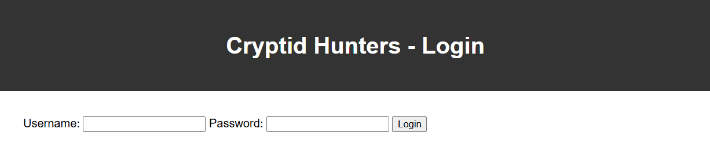

# cryptid-hunters

## Scenario

> The intern found some web traffic originating from a known Consortium IP to this website. The website looks like a 7th grader's project.
>
> Most of NICC took a look at it and blew it off, but Maya thinks there may be something worth looking into. Mary and the others tell her they are too busy and it is a waste of time. She is getting pretty sick and tired of no one taking her seriously. If she finds a lead she is going to follow it. NICC needs all the help they can get, whether its a Sasquatch or a giant clam!

## Hints

- The hunters' webmaster is very tech illiterate. It seems like he just followed some intro level tutorial or used some free AI tool for the code.

## Solution



Well another SQL injection challenge. This time we have a simple login form. We can try to login with some random credentials and see what happens. We can see that the page returns `Invalid username or password` if we enter wrong credentials. We can try to login with `' OR 1=1 --` as the username and password. This will return list of cryptids. The flag is hidden in the list of cryptids.

```sql
' OR 1=1 -- 
```

## Flag

`NICC{1N_PuRSu1T_0F_4LL13S}`
